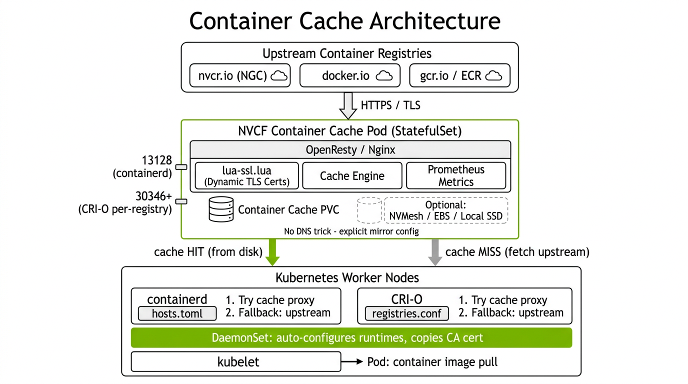
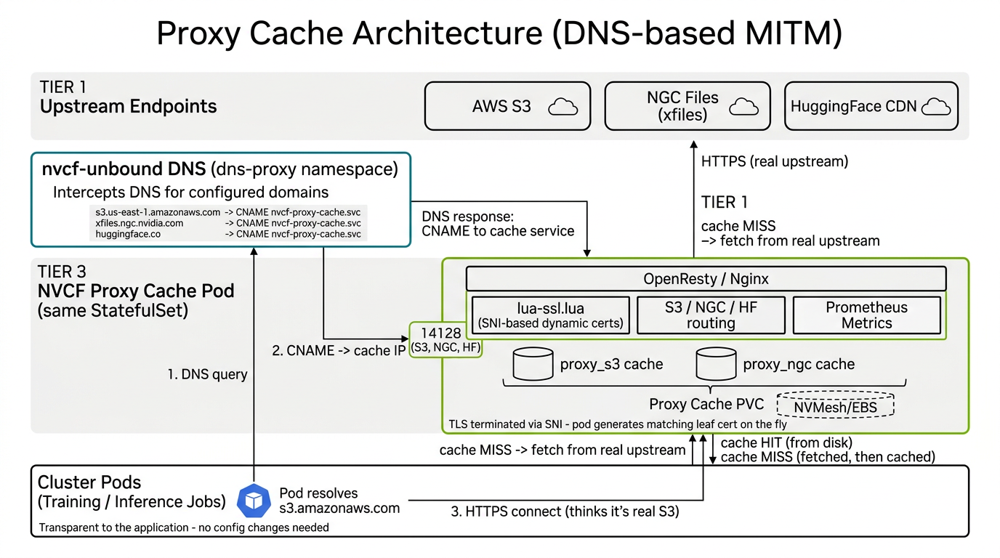
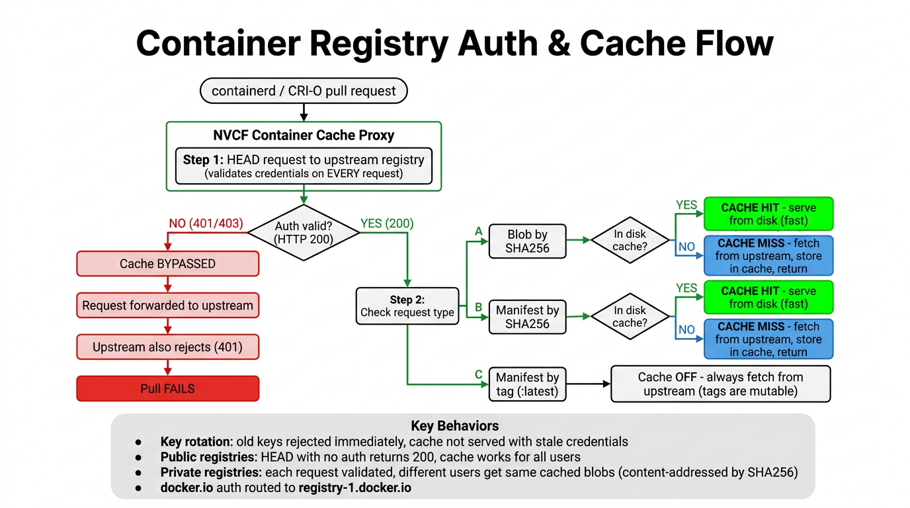
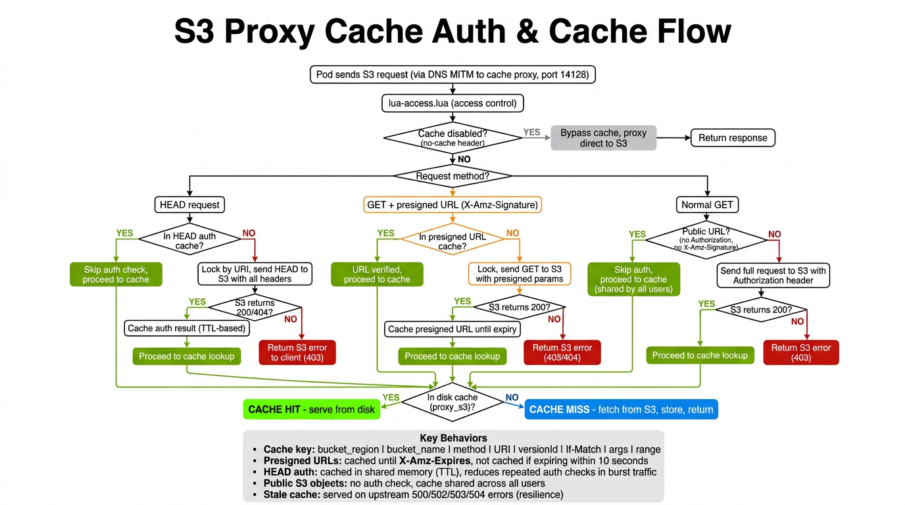

<!--
SPDX-FileCopyrightText: Copyright (c) 2023-2025 NVIDIA CORPORATION & AFFILIATES. All rights reserved.
SPDX-License-Identifier: Apache-2.0

Licensed under the Apache License, Version 2.0 (the "License");
you may not use this file except in compliance with the License.
You may obtain a copy of the License at

    http://www.apache.org/licenses/LICENSE-2.0

Unless required by applicable law or agreed to in writing, software
distributed under the License is distributed on an "AS IS" BASIS,
WITHOUT WARRANTIES OR CONDITIONS OF ANY KIND, either express or implied.
See the License for the specific language governing permissions and
limitations under the License.
-->
# NVCF Container Cache

**Version:** 0.25.12
**Application Version:** 1.2.1
**Chart Name:** nvcf-container-cache

## Table of Contents
- [Overview](#overview)
- [Architecture](#architecture)
  - [Container Cache](#container-cache)
  - [Proxy Cache](#proxy-cache)
  - [Authentication Flow (Container Registries)](#authentication-flow-container-registries)
  - [Authentication Flow (S3 Proxy Cache)](#authentication-flow-s3-proxy-cache)
- [Prerequisites](#prerequisites)
- [Configuration Reference](#configuration-reference)
- [Deployment Guide](#deployment-guide)
- [Container Runtime Support](#container-runtime-support)
- [Uninstallation and Cleanup](#uninstallation-and-cleanup)
- [Troubleshooting](#troubleshooting)

---

## Overview

NVCF Container Cache is a high-performance caching system with two complementary modes:

- **Container Cache** -- caches container image pulls (OCI/Docker registry protocol) for containerd and CRI-O
- **Proxy Cache** -- caches S3 objects, NGC assets, HuggingFace models, and Nucleus files via DNS-based MITM

Both run in the same StatefulSet pod and share the OpenResty/Nginx engine with dynamic TLS certificate generation.

### Key Features
- **Multi-runtime**: Supports both containerd and CRI-O for container image caching
- **Multi-endpoint**: S3, NGC Files, HuggingFace CDN, Nucleus/LFT for proxy caching
- **Multi-registry**: NGC, Docker Hub, GCR, ECR, and any OCI-compliant registry
- **Transparent fallback**: If the cache is unavailable, container pulls fall through to the upstream registry
- **DNS-based MITM**: nvcf-unbound DNS redirects S3/NGC/HF traffic to the proxy cache transparently
- **Dynamic TLS**: Generates leaf certificates on-the-fly signed by a bundled CA (SNI-based)
- **Auto-configuration**: DaemonSet configures container runtimes on every node automatically
- **Disk-pressure aware**: `min_free` watermark prevents the cache from filling the disk
- **Observable**: Prometheus metrics, structured JSON logs, optional OpenTelemetry traces

---

## Architecture

The system has two caching modes that serve different traffic types.

### Container Cache

Caches container image layers and manifests pulled by containerd or CRI-O. Routing is via explicit mirror configuration written by the DaemonSet -- no DNS trick involved.



```
                     +---------------------------+
                     |  Upstream Registries       |
                     |  (nvcr.io, docker.io, etc) |
                     +------------+--------------+
                                  |
                                  | HTTPS
                                  v
                  +-------------------------------+
                  | NVCF Container Cache Pod       |
                  | (OpenResty/Nginx, StatefulSet) |
                  |                                |
                  |  lua-ssl.lua    Cache Engine   |
                  |  (dynamic TLS)  (disk cache)   |
                  |                                |
                  |  Ports: 13128 (containerd)     |
                  |         30346+ (CRI-O)         |
                  +-------+--------------+--------+
                          |              |
              cache HIT   |              |  cache MISS
              (from disk) |              |  (fetch upstream)
                          v              v
     +----------------------------------------------------+
     |            Kubernetes Worker Nodes                   |
     |                                                     |
     |  containerd            CRI-O                        |
     |  hosts.toml:           registries.conf:             |
     |   1. Try cache          1. Try cache                |
     |   2. Fallback           2. Fallback                 |
     |                                                     |
     |  DaemonSet: writes mirror config, copies CA cert    |
     |                                                     |
     |  kubelet --> Pod: container image pull               |
     +----------------------------------------------------+
```

**How a cached pull works:**

1. **kubelet** asks the container runtime to pull `nvcr.io/nvidia/cuda:12.4.0`
2. **containerd/CRI-O** checks its mirror config (`hosts.toml` / `registries.conf`)
3. The request is routed to the **cache proxy** (via NodePort or pod IP)
4. The proxy checks its **on-disk cache**:
   - **HIT**: Returns the cached layer immediately
   - **MISS**: Fetches from the upstream registry, caches it, and returns it
5. If the cache proxy is **unreachable**, the runtime falls back to the **upstream registry** directly

### Proxy Cache

Caches S3 objects, NGC assets, and HuggingFace models. Uses DNS-based MITM via nvcf-unbound: DNS resolution for configured domains returns a CNAME pointing to the cache service, so pods connect to the cache thinking it is the real endpoint. The cache terminates TLS using SNI (lua-ssl.lua generates a matching leaf certificate on the fly) and proxies to the real upstream.



```
                     +---------------------------------------+
                     |         Upstream Endpoints             |
                     |  AWS S3 | NGC Files | HuggingFace CDN |
                     +------------------+--------------------+
                                        ^
                                        | HTTPS (real upstream)
                                        |
  +---------------------------+    +----+------------------------------+
  | nvcf-unbound DNS          |    | NVCF Proxy Cache Pod              |
  | (dns-proxy namespace)     |    | (same StatefulSet, port 14128)    |
  |                           |    |                                   |
  | Intercepts DNS:           |    |  lua-ssl.lua    S3/NGC/HF routing |
  |  s3.amazonaws.com         |    |  (SNI certs)    proxy_s3 cache    |
  |  xfiles.ngc.nvidia.com    +--->|                 proxy_ngc cache   |
  |  huggingface.co           |    |                                   |
  |                           |    |  Proxy Cache PVC (disk)           |
  | Returns CNAME:            |    +----+------------------------------+
  |  -> nvcf-proxy-cache.svc  |         |
  +----------+----------------+         | cache HIT / MISS
             ^                          v
             | 1. DNS query    3. HTTPS connect
             |                 (thinks it's real S3)
     +-------+------------------------------------+
     |     Cluster Pods (Training/Inference Jobs)  |
     |                                             |
     |  Transparent to the application:            |
     |  no config changes needed in the pod.       |
     +---------------------------------------------+
```

**How DNS-based MITM caching works:**

1. A **training pod** calls `s3.us-east-1.amazonaws.com` to download a dataset
2. The DNS query goes to **nvcf-unbound**, which returns a CNAME pointing to `nvcf-proxy-cache.container-caching.svc.cluster.local`
3. The pod connects to the **cache pod** on port 14128 via TLS, presenting the original hostname as SNI
4. **lua-ssl.lua** dynamically generates a leaf certificate matching the SNI hostname
5. The cache checks its **on-disk cache** (`proxy_s3` or `proxy_ngc` zone):
   - **HIT**: Returns the cached response immediately
   - **MISS**: Proxies to the real upstream, caches the response, and returns it
6. The pod receives the response as if it came directly from S3 -- completely transparent

### Authentication Flow (Container Registries)

The cache validates credentials on **every request** by sending a HEAD to the upstream registry before serving cached content. This ensures revoked or rotated keys are rejected immediately.



Key behaviors:
- **Key rotation**: Old keys are rejected immediately. The cache never serves content with stale credentials.
- **Public registries**: HEAD with no auth header returns 200, so caching works for all users with no configuration needed.
- **Private registries**: Each request is validated against the upstream. Different users sharing the same cluster get the same cached blobs (blobs are content-addressed by SHA256, so identical content is safe to share).
- **Manifest by tag** (e.g., `:latest`): Never cached. Tags are mutable, so every request goes to the upstream registry to get the current digest.
- **Node-local cache**: Once an image is pulled to a node, it is available to all pods on that node without auth. Set `imagePullPolicy: Always` to force re-validation through the cache on every pod start.

### Authentication Flow (S3 Proxy Cache)

The S3 proxy cache validates access on every request using `lua-access.lua`. The logic differs by request type (HEAD, presigned URL GET, normal GET) and uses shared-memory caches to avoid redundant upstream calls during burst traffic.



```
                   +-- Cache disabled? (no-cache header) --YES--> Bypass, proxy direct to S3
                   |
  S3 request ----->+
  (port 14128)     |
                   +-- Request method?
                       |
         +-------------+-------------+
         |             |             |
       HEAD         GET+presigned  Normal GET
         |           URL             |
         v             |             v
  In HEAD auth         v        Public URL?
    cache? ----YES--> Skip     (no Authorization,
         |           auth       no X-Amz-Signature)
         NO            |             |
         |        In presigned  YES: skip auth,
         v        URL cache?    cache shared
  Lock by URI,         |        by all users
  HEAD to S3     YES: skip           |
  with headers   auth          NO: send full
         |             |        request to S3
         v             NO       with Authorization
  S3 200/404?          |             |
  YES: cache     Lock, GET           v
  auth result    to S3 with    S3 200?
  (TTL-based)    presigned     YES: proceed
         |       params        NO: return 403
         |             |
         |        S3 200?
         |        YES: cache
         |        until expiry
         |        NO: return
         |        403/404
         |             |
         +------+------+------+
                |
                v
         In disk cache
         (proxy_s3)?
        /            \
      YES             NO
       |               |
   CACHE HIT       CACHE MISS
   serve from      fetch from
   disk            S3, store,
                   return
```

Key behaviors:
- **Cache key**: `bucket_region | bucket_name | method | URI | versionId | If-Match | filtered_args | range`. This ensures different buckets, versions, and byte ranges are cached independently.
- **Presigned URLs**: Cached until their `X-Amz-Expires` time minus a 10-second safety margin. This avoids serving content after the presigned URL has expired.
- **HEAD auth caching**: HEAD results are cached in shared memory with a configurable TTL. This dramatically reduces upstream calls during burst traffic (e.g., hundreds of pods starting simultaneously and checking the same S3 object).
- **Public S3 objects**: If a request has no `Authorization` header and no `X-Amz-Signature` query parameter, it is treated as public. No upstream auth check is performed, and the cached object is shared across all users.
- **Locking**: Concurrent requests for the same URI are serialized using a lock (`resty.lock`) to avoid thundering herd -- only one request performs the upstream auth check, and subsequent requests use the cached result.
- **Stale cache resilience**: On upstream errors (500/502/503/504), stale cached content is served rather than returning an error to the client.
- **If-Match / ETag**: The `If-Match` header is preserved end-to-end (S3 normally expects it for content integrity) and is included in the cache key to avoid serving mismatched content.
- **Last-Modified validation**: On cache HIT, the proxy compares the cached `Last-Modified` timestamp against the upstream value. If upstream is newer, the stale entry is purged and a 429 is returned so the client retries and gets fresh content.

---

## Prerequisites

1. **Kubernetes** 1.19+ with containerd or CRI-O runtime
2. **Helm** 3.x
3. **NGC API Key** for pulling NVIDIA container images
4. **Storage**: Persistent volumes or sufficient node storage
5. **Network**: Outbound HTTPS to target registries

---

## Configuration Reference

### Core Settings

| Parameter | Default | Description |
|-----------|---------|-------------|
| `nodeSelector` | `{}` | Node labels for cache pod placement |
| `replicaCount` | `1` | Number of cache StatefulSet replicas |
| `targetHost` | `nvcr.io,stg.nvcr.io` | Comma-separated registries to cache |

### Images

| Parameter | Default | Description |
|-----------|---------|-------------|
| `images.server` | `<your-registry>/<your-org>/nvcf-container-cache:v1.1.33` | Cache proxy image |
| `images.exporter` | `<your-registry>/<your-org>/nginx-prometheus-exporter:1.0` | Metrics exporter |
| `images.certificates` | `<your-registry>/<your-org>/nvcf-proxy-tls-certs:1.2.2` | TLS cert bundle |
| `images.secrets` | `[nvidia-ngcuser-pull-secret]` | Image pull secrets |

### Cache Behavior

| Parameter | Default | Description |
|-----------|---------|-------------|
| `cache.keyStorageSize` | `50m` | Shared memory for cache keys |
| `cache.maxSize` | `500g` | Max on-disk cache size |
| `cache.inactive` | `30d` | Evict entries not accessed in this period |
| `cache.valid` | `12h` | Revalidate cached entries after this period |
| `cache.http2` | `off` | HTTP/2 for ingress listeners |
| `cache.workerConnection` | `1000` | Nginx worker connections |

### Storage

| Parameter | Default | Description |
|-----------|---------|-------------|
| `persistentVolumeClaim.storageClassName` | `emptydir` | Storage class (`emptydir` for ephemeral) |
| `persistentVolumeClaim.sizeGB` | `100` | Container cache volume (Gi) |
| `persistentVolumeClaim.sizeProxyGB` | `200` | Proxy cache volume (Gi) |
| `persistentVolumeClaim.freeProxyPct` | `10` | Min free space percentage |

### Service

| Parameter | Default | Description |
|-----------|---------|-------------|
| `service.type` | `NodePort` | `NodePort`, `ClusterIP`, or `LoadBalancer` |
| `service.port` | `30345` | Primary service port |

### CRI-O

| Parameter | Default | Description |
|-----------|---------|-------------|
| `crio.registryPorts` | `[]` | Manual per-registry port mappings |
| `crio.basePort` | `service.port + 1` | Starting port for auto-derived CRI-O ports |
| `crio.mirrorHost` | `nvcf-container-cache.<ns>.svc.cluster.local` | Mirror hostname for CRI-O |
| `crio.nodePortLocal` | `true` | Set `externalTrafficPolicy: Local` on NodePort |

CRI-O requires a separate listening port per registry (unlike containerd which uses `?ns=` query params). Ports are auto-derived from `targetHost` starting at `basePort`:

| targetHost | Auto port |
|------------|-----------|
| `nvcr.io` | 30346 |
| `stg.nvcr.io` | 30347 |

### Security

| Parameter | Default | Description |
|-----------|---------|-------------|
| `vault.enabled` | `false` | Enable HashiCorp Vault for cert management |
| `vault.vaultAddress` | `https://vault.example.com` | Vault server URL |
| `vault.certLocation` | `""` | URL to download CA cert (vault mode) |

When `vault.enabled=false`, the bundled TLS certificates from the `images.certificates` image are used. The proxy dynamically generates leaf certificates signed by the bundled intermediate CA.

### Observability

| Parameter | Default | Description |
|-----------|---------|-------------|
| `monitoring.enabled` | `false` | Deploy the `nginx-prometheus-exporter` sidecar **and** create a PodMonitor for Prometheus. When `false`, neither is rendered and the `images.exporter` image does not need to be reachable. The lua-prometheus endpoint on `cache-metrics` (port 9145) is unaffected by this setting and remains available for in-cluster scraping. |
| `metrics.cacheMetricsStorageSize` | `300m` | Shared memory for Prometheus metrics |
| `traces.enabled` | `false` | Enable OpenTelemetry tracing |
| `nucleus.enabled` | `false` | Enable nucleus proxy integration |

---

## Deployment Guide

### 1. Create namespace and pull secret

```bash
kubectl create namespace container-caching

kubectl create secret docker-registry nvidia-ngcuser-pull-secret \
  --docker-server=nvcr.io \
  --docker-username='$oauthtoken' \
  --docker-password=<NGC_API_KEY> \
  -n container-caching
```

### 2. Create a values file

```yaml
# my-values.yaml
nodeSelector:
  nodeGroup: monitoring

replicaCount: 1
targetHost: nvcr.io,stg.nvcr.io

images:
  server: <your-registry>/<your-org>/nvcf-container-cache:v1.1.33
  exporter: <your-registry>/<your-org>/nginx-prometheus-exporter:1.0
  certificates: <your-registry>/<your-org>/nvcf-proxy-tls-certs:1.2.2
  secrets:
    - nvidia-ngcuser-pull-secret

service:
  type: NodePort
  port: 30345

persistentVolumeClaim:
  storageClassName: premium-rwo
  sizeProxyGB: 200
  sizeGB: 100
  freeProxyPct: 10

vault:
  enabled: false

monitoring:
  enabled: false
```

### 3. Install

```bash
helm install nvcf-container-cache ./deploy \
  -n container-caching \
  -f my-values.yaml
```

### 4. Verify

```bash
# Check all resources
kubectl -n container-caching get pods,svc,ds

# Verify containerd config on a node
kubectl -n container-caching exec ds/nvcf-container-cache-cc -- \
  cat /host/etc/containerd/certs.d/nvcr.io/hosts.toml
```

Expected `hosts.toml`:
```toml
server = "https://nvcr.io"
[host."https://10.0.0.27:30345"]
capabilities = ["pull", "resolve"]
ca = "/etc/ssl/nginx_container_cache.crt"
skip_verify = true
[host."https://nvcr.io"]
capabilities = ["pull", "resolve"]
```

The `skip_verify = true` is needed because the proxy's dynamically-generated TLS certificate cannot match every node IP when traffic arrives via NodePort (kube-proxy NATs the original destination IP). The explicit `[host."https://nvcr.io"]` entry ensures containerd falls back to the upstream registry if the cache is unavailable.

---

## Container Runtime Support

### containerd

The DaemonSet writes `hosts.toml` files to `/etc/containerd/certs.d/<registry>/` on every node. containerd reads these dynamically on each pull without requiring a restart. The configuration:

1. Routes pulls through the cache proxy (via NodePort)
2. Falls back to the upstream registry if the proxy is unreachable
3. Trusts the cache's CA certificate

### CRI-O

CRI-O uses a different configuration model (`registries.conf` instead of `hosts.toml`). Key differences:

- CRI-O does not support `?ns=` query parameters, so each registry needs a **dedicated port**
- The DaemonSet writes to `/etc/containers/registries.conf.d/nvcf-container-cache.conf`
- CRI-O mirrors are configured using pod IPs (discovered via Kubernetes API) or the service hostname
- The DaemonSet refreshes CRI-O mirrors every 5 minutes and signals CRI-O to reload
- An RBAC Role/RoleBinding grants the DaemonSet permission to list pods (for IP discovery)

CRI-O auto-detection: if `/etc/containers` exists on a node, the DaemonSet configures CRI-O. If `/etc/containerd` exists, it configures containerd. Both can coexist.

---

## Uninstallation and Cleanup

### 1. Uninstall the Helm release

```bash
helm uninstall nvcf-container-cache -n container-caching
```

### 2. Clean up node configuration

The DaemonSet modifies containerd/CRI-O configuration on every node. After uninstalling, run the cleanup tool to remove these modifications:

```bash
# Deploy cleanup DaemonSet, wait, then remove it
./client/remove/remove-containerd-configuration.sh
```

Or manually:
```bash
kubectl create -f ./client/remove/remove-containerd-configuration.yaml
kubectl wait --for=condition=ready pod -l name=remove-containerd-configuration \
  -n kube-system --timeout=120s
kubectl delete -f ./client/remove/remove-containerd-configuration.yaml
```

The cleanup tool:
- Removes `hosts.toml` files from `/etc/containerd/certs.d/` for each target registry
- Restores `config.toml` from the backup created during installation
- Removes CRI-O registry mirror config (`nvcf-container-cache.conf`)
- Removes CRI-O drop-in config (`99-nvcf-registry.conf`)
- Removes per-registry CA certificates from `/etc/containers/certs.d/`
- Removes the shared CA cert (`/etc/ssl/nginx_container_cache.crt`)
- Restarts containerd and reloads CRI-O

### 3. Delete persistent data

```bash
kubectl -n container-caching delete pvc --all
kubectl delete namespace container-caching
```

---

## Troubleshooting

### TLS errors: `certificate is valid for X, not Y`

This means the proxy's dynamically-generated certificate SAN doesn't match the IP the client connected to. This is expected with NodePort traffic (kube-proxy NATs the destination IP). The `skip_verify = true` in `hosts.toml` resolves this for containerd. For CRI-O, `insecure = true` is set when using the service hostname.

### Connection refused on NodePort

The cache pod or service was deleted (e.g., by a GitOps controller pruning resources). With the fallback `[host."https://nvcr.io"]` entry in `hosts.toml`, containerd should fall through to the upstream registry. If not, check:

```bash
# Verify cache pods are running
kubectl -n container-caching get pods

# Check hosts.toml has fallback entry
kubectl -n container-caching exec ds/nvcf-container-cache-cc -- \
  cat /host/etc/containerd/certs.d/nvcr.io/hosts.toml
```

### Cache always shows MISS

- Verify the DaemonSet has configured the runtime on the node
- Check that the cache service is accessible: `curl -k https://<NODE_IP>:30345/v2/`
- Confirm cache disk has space: `kubectl exec nvcf-container-cache-0 -- df -h /container_cache`

### CRI-O mirrors not updating

The DaemonSet refreshes CRI-O mirrors every 5 minutes. Check:

```bash
# View DaemonSet logs
kubectl -n container-caching logs ds/nvcf-container-cache-cc

# Check registries.conf on a node
kubectl -n container-caching exec ds/nvcf-container-cache-cc -- \
  cat /host/etc/containers/registries.conf.d/nvcf-container-cache.conf
```

---

### Debug commands

```bash
# Nginx proxy logs
kubectl -n container-caching logs nvcf-container-cache-0 -c nginx-proxy --tail=50

# Cache hit/miss activity
kubectl -n container-caching logs nvcf-container-cache-0 -c nginx-proxy | \
  grep -oP '"upstream_cache_status":"\K[^"]+' | sort | uniq -c

# Rendered nginx configuration
kubectl -n container-caching exec nvcf-container-cache-0 -c nginx-proxy -- nginx -T
```
