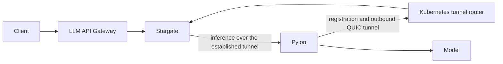

# Standalone LLM routing POC

One Helm release installs three small deployments using the existing service charts:

| Component | Purpose | Ports |
| --- | --- | --- |
| LLM API Gateway | OpenAI HTTP front door and token accounting | TCP 8080, metrics 9464 |
| Stargate | Model selection, worker registration, reverse tunnels | TCP 8000/50071, UDP 50072, metrics 9090 |
| Stargate Kubernetes router | Routes registration and tunnels to the correct Stargate pod | TCP 50071, UDP 50072, health/metrics 8080 |

Pylon opens the outbound reverse tunnel from beside the model. It belongs with a recipe or agent-managed transport deployment, not in the gateway deployment. The optional CPU fixture adds a mock OpenAI backend with Pylon and a separate legacy worker-auth test server. Keeping auth separate allows model removal without removing the authenticator.



The release needs Kubernetes and images. It does not install the NVCF control plane, NATS, a database, Vault, cert-manager, a GPU operator, or a monitoring stack. Metrics endpoints are enabled for an operator-owned collector. One replica per component is the small-cluster default.

## Current limits

This is a deployment POC using the existing gateway and router contract. It is not the complete standalone inference product.

- The current gateway requires `routingKey/model`. Bare-model routing and the standalone `/v1/models` registry need gateway changes.
- Caller auth is disabled in this isolated POC. The worker-auth fixture checks a public test token and assigns the `poc` routing key. It does not authenticate cluster identity.
- QUIC certificate verification is disabled in the POC. Complete deployment needs caller TLS, a static caller key, authenticated cluster identity, and trusted registration/tunnel transport.
- The LLM agent, InferenceEndpoint CRD, GPU recipes, and monitoring stack are separate work.
- The fixture returns fixed text. It proves routing and streaming, not model quality, GPU execution, throughput, or production capacity.

The chart refuses installation unless `developmentMode=true` is explicit. Use ClusterIP access through a loopback port-forward in a disposable development cluster. The existing child charts retain unused Vault template ConfigMaps and token projections, but no Vault process or injection is used.

## Build and install the CPU POC

From the repository root, package the local dependencies without refreshing external Helm repositories:

```bash
helm dependency build --skip-refresh deploy/helm/llm-routing
bash deploy/helm/llm-routing/tests/render.sh
```

Build the fixture with the gateway's existing Go dependencies. Set GOARCH for the target node architecture:

```bash
mkdir -p /tmp/llm-routing-fixture
cd src/invocation-plane-services/llm-api-gateway
CGO_ENABLED=0 GOOS=linux GOARCH=amd64 go build -o /tmp/llm-routing-fixture/fixture ../../../deploy/helm/llm-routing/tests/fixture.go
cd ../../..
cp deploy/helm/llm-routing/tests/Dockerfile /tmp/llm-routing-fixture/Dockerfile
docker build -t llm-routing-fixture:dev /tmp/llm-routing-fixture
```

Create an external `images.yaml` using repositories you can access:

```yaml
gateway:
  llmApiGateway:
    image:
      repository: registry.example.com/llm-api-gateway
      tag: "0.14.2"
router:
  llmRequestRouter:
    image:
      repository: registry.example.com/stargate
      tag: "0.18.0"
fixture:
  pylonImage: registry.example.com/pylon:0.18.0
```

Preload these images and `llm-routing-fixture:dev` into your cluster, or provide image pull credentials through the child charts' `imagePullSecrets`. The fixture images must already be loaded for the example below. Use one release per namespace because the child charts use fixed service names.

```bash
helm upgrade --install llm-routing deploy/helm/llm-routing \
  --kube-context k3d-llm-routing-poc --namespace llm-routing --create-namespace \
  -f deploy/helm/llm-routing/values.poc.yaml -f images.yaml --wait --timeout 3m
bash deploy/helm/llm-routing/tests/smoke.sh k3d-llm-routing-poc
```

The smoke test checks regular and streaming chat, exact mock response and token usage, missing-prefix rejection, and unknown-model rejection. It creates a temporary loopback port-forward and closes it on exit.

## Manual request

```bash
kubectl --context k3d-llm-routing-poc -n llm-routing port-forward svc/llm-api-gateway 18080:8080
```

In another terminal:

```bash
curl http://127.0.0.1:18080/v1/chat/completions \
  -H 'Content-Type: application/json' \
  -d '{"model":"poc/poc-model","messages":[{"role":"user","content":"Hello"}],"stream":true}'
```

## Offline and architecture checks

Resolve registry access and collect images before going offline. Package the chart with `helm package deploy/helm/llm-routing` after building its local dependencies. Transfer the package, fixture image, and all three service images to the target. No chart repository is needed to install the package.

The configured image pull policy is `IfNotPresent`. To prove a deployment uses only cached images, override the gateway, router, backend router, and fixture pull policies to `Never` and reinstall on the prepared cluster. Check registry manifests for `linux/arm64` before a Spark installation. An amd64 VM test does not validate arm64 execution or GPU support.

For Docker/containerd image transfer, export only the target architecture. An image index may reference architectures that were never downloaded:

```bash
docker save --platform linux/amd64 IMAGE | docker exec -i K3D_NODE ctr -n k8s.io images import --platform linux/amd64 -
```

## Cleanup

Remove the release when finished. For a disposable k3d cluster, deleting that named cluster also removes its releases and cluster data:

```bash
helm uninstall llm-routing --kube-context k3d-llm-routing-poc -n llm-routing
k3d cluster delete llm-routing-poc
```

Keep source worktrees, image credentials, and unrelated Docker data separate from cluster cleanup.
