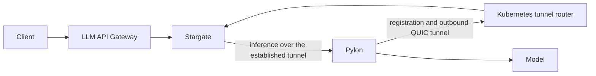

# Standalone LLM routing POC

One Helm release installs three small deployments using the existing service charts:

| Component | Purpose | Ports |
| --- | --- | --- |
| LLM API Gateway | OpenAI HTTP front door and token accounting | TCP 8080, metrics 9464 |
| Stargate | Model selection, worker registration, reverse tunnels | TCP 8000/50071, UDP 50072, metrics 9090 |
| Stargate Kubernetes router | Routes registration and tunnels to the correct Stargate pod | TCP 50071, UDP 50072, health/metrics 8080 |

Pylon opens the outbound reverse tunnel from beside the model. It belongs with a recipe or agent-managed transport deployment, not in the gateway deployment. The optional CPU fixture adds a mock OpenAI backend with Pylon and a separate legacy worker-auth test server. Keeping auth separate allows model removal without removing the authenticator.



The release needs Kubernetes and images. It does not install the NVCF control plane, NATS, a database, Vault, cert-manager, a GPU operator, or a monitoring stack. Metrics endpoints are enabled for an operator-owned collector. One replica per component is the small-cluster default.

## Current limits

This is a deployment POC using the existing gateway and router contract. It is not the complete standalone inference product.

- The current gateway requires `routingKey/model`. Bare-model routing and the standalone `/v1/models` registry need gateway changes.
- Caller auth is disabled in this isolated POC. The worker-auth fixture checks a public test token and assigns the `poc` routing key. It does not authenticate cluster identity.
- QUIC certificate verification is disabled in the POC. Complete deployment needs caller TLS, a static caller key, authenticated cluster identity, and trusted registration/tunnel transport.
- The LLM agent, InferenceEndpoint CRD, GPU recipes, and monitoring stack are separate work.
- The fixture returns fixed text. It exercises routing and SSE responses, not model quality, GPU execution, throughput, or production capacity.

The chart refuses installation unless `developmentMode=true` is explicit. Use ClusterIP access through a loopback port-forward in a disposable development cluster. The existing child charts retain unused Vault template ConfigMaps and token projections, but no Vault process or injection is used.

## Local k3d assumptions

You can run this POC on an existing local k3d cluster. No remote VM or GPU is required.

For Docker, k3d, kubectl, and Helm installation, see the [local quickstart prerequisites](../../../docs/overview/quickstart.md#prerequisites). Only those tools are needed from that guide. Its full-stack cluster bootstrap, Helmfile, NVCF CLI, and fake GPUs are unnecessary here. Also install Bash, Python 3, Docker Buildx, and Go compatible with the gateway's `go.mod` (currently 1.25.6 or later).

- Use a full checkout of this branch or commit. The chart references sibling charts, and the fixture builds against the gateway's Go module.
- Use a development cluster with working pod networking, the default `cluster.local` DNS domain, and nodes of the same CPU architecture. You need permission to create namespaced workloads and RBAC.
- Docker must use the daemon running the k3d nodes. Host Docker images must be imported into the nodes' containerd stores.
- Obtain the gateway, Stargate, and Pylon image locations and registry access separately. Authenticate Docker before pulling. The examples use placeholders. Initial setup needs network access for images and Go dependencies.
- Use an unused namespace. Fixed service names allow one routing release per namespace. The CPU POC creates five deployments.

The commands below run in one Bash session from the repository root. Select your existing cluster and inspect its nodes and Helm releases first:

```bash
k3d cluster list
llm_cluster=my-local-cluster # Replace with your existing k3d cluster name.
llm_context="k3d-${llm_cluster}"
llm_namespace=llm-routing-poc
kubectl --context "$llm_context" get nodes -L kubernetes.io/arch
helm list --kube-context "$llm_context" --all-namespaces
```

If the context is missing, use `export KUBECONFIG=$(k3d kubeconfig write "$llm_cluster")`. Adjust `llm_context` if you renamed it. If you need a new empty cluster, `k3d cluster create llm-routing-poc --servers 1 --agents 0` is sufficient. Set `llm_cluster` and `llm_context` accordingly.

## Build the CPU fixture

Package the local chart dependencies and check rendering:

```bash
helm dependency build --skip-refresh deploy/helm/llm-routing
bash deploy/helm/llm-routing/tests/render.sh
```

Match the Go binary and images to the cluster architecture (`amd64` or `arm64`):

```bash
llm_arch=$(kubectl --context "$llm_context" get nodes -o jsonpath='{.items[0].status.nodeInfo.architecture}')
llm_platform="linux/${llm_arch}"
llm_workdir=$(mktemp -d "${TMPDIR:-/tmp}/llm-routing.XXXXXX")
llm_fixture="llm-routing-fixture:local-$(date +%Y%m%d%H%M%S)"
(
  cd src/invocation-plane-services/llm-api-gateway
  CGO_ENABLED=0 GOOS=linux GOARCH="$llm_arch" go build \
    -o "$llm_workdir/fixture" ../../../deploy/helm/llm-routing/tests/fixture.go
)
cp deploy/helm/llm-routing/tests/Dockerfile "$llm_workdir/Dockerfile"
docker build --platform "$llm_platform" --load -t "$llm_fixture" "$llm_workdir"
```

The unique tag avoids stale cached fixtures. Keep these shell variables for the following steps. Build artifacts and private values stay in `llm_workdir`, outside the checkout.

## Load images into k3d

Replace these repository placeholders. The Stargate image must include both Stargate and the Kubernetes tunnel router binary. Each service image must support `llm_platform`.

```bash
llm_gateway_repo=registry.example.com/llm-api-gateway
llm_stargate_repo=registry.example.com/stargate
llm_gateway_image="${llm_gateway_repo}:0.14.2"
llm_stargate_image="${llm_stargate_repo}:0.18.0"
llm_pylon_image=registry.example.com/pylon:0.18.0

for llm_image in "$llm_gateway_image" "$llm_stargate_image" "$llm_pylon_image"; do
  docker pull --platform "$llm_platform" "$llm_image"
done
k3d image import -c "$llm_cluster" \
  "$llm_gateway_image" "$llm_stargate_image" "$llm_pylon_image" "$llm_fixture"
```

The import targets all nodes of the selected cluster. Stop on any pull or import error. For missing-digest errors, see the fallback below.

This workflow preloads images and uses `pullPolicy: Never`. Child-chart `imagePullSecrets` cover only the gateway and routers, so they cannot replace preloading the fixture and Pylon images.

Create the values file using exactly the imported image names:

```bash
cat > "$llm_workdir/images.yaml" <<EOF
gateway:
  llmApiGateway:
    image:
      repository: ${llm_gateway_repo}
      tag: "0.14.2"
      pullPolicy: Never
router:
  llmRequestRouter:
    image:
      repository: ${llm_stargate_repo}
      tag: "0.18.0"
      pullPolicy: Never
    backendRouter:
      image:
        pullPolicy: Never
fixture:
  image: ${llm_fixture}
  pylonImage: ${llm_pylon_image}
  pullPolicy: Never
EOF
```

## Install and test

```bash
helm upgrade --install llm-routing deploy/helm/llm-routing \
  --kube-context "$llm_context" --namespace "$llm_namespace" --create-namespace \
  -f deploy/helm/llm-routing/values.poc.yaml -f "$llm_workdir/images.yaml" \
  --wait --timeout 3m
bash deploy/helm/llm-routing/tests/smoke.sh "$llm_context" "$llm_namespace" 18080
```

The smoke test uses the default `poc/poc-model` fixture settings. It checks regular chat, SSE content and completion marker, token usage, missing-prefix rejection, and unknown-model rejection. It reads the complete SSE response, so it does not detect buffering or validate chunk timing. The script opens a loopback port-forward and closes it on exit. If port 18080 is occupied, supply a different local port as the third argument.

`ErrImageNeverPull` means the exact image name is missing from the scheduled node. Import it into every cluster node. For scheduling failures, check node capacity and taints.

## Manual request

In the same shell, open a port-forward:

```bash
kubectl --context "$llm_context" -n "$llm_namespace" port-forward svc/llm-api-gateway 18080:8080
```

In another terminal:

```bash
curl --no-buffer http://127.0.0.1:18080/v1/chat/completions \
  -H 'Content-Type: application/json' \
  -d '{"model":"poc/poc-model","messages":[{"role":"user","content":"Hello"}],"stream":true}'
```

## Image import fallback

An image index can reference architectures that were never downloaded. If the normal import fails with missing-digest errors, export only the target architecture and import it directly into each node. This fallback requires a Docker client and daemon supporting [image save --platform](https://docs.docker.com/reference/cli/docker/image/save/#save-a-specific-platform---platform) (API 1.48 or later). k3d node names correspond to Docker container names.

```bash
set -o pipefail
for llm_image in "$llm_gateway_image" "$llm_stargate_image" "$llm_pylon_image" "$llm_fixture"; do
  for llm_node in $(kubectl --context "$llm_context" get nodes -o jsonpath='{.items[*].metadata.name}'); do
    docker save --platform "$llm_platform" "$llm_image" | \
      docker exec -i "$llm_node" ctr -n k8s.io images import --platform "$llm_platform" -
  done
done
```

Check that each import succeeds before retrying Helm. If your Docker version lacks `save --platform`, upgrade it before using this fallback.

## Validation scope and offline use

The runtime POC was validated on an amd64 k3d cluster. The fixture also cross-compiles for arm64, but arm64 runtime, Spark hardware, and GPU inference have not been validated. Local k3d uses the same chart and services, subject to the assumptions above.

The chart defaults to `IfNotPresent`. The local example overrides it to `Never` to expose missing imports and exercise cached-image startup. This does not establish that the whole setup works on a disconnected machine.

For offline installation, collect the service images and build the fixture while online. Run `helm package deploy/helm/llm-routing` after building its dependencies. Transfer the package, all four images, and your values file to the target. Import the images into its nodes before installation. The packaged chart needs no chart repository, but an offline fixture build additionally requires the Go toolchain and dependencies to be cached.

## Cleanup

Remove only the POC release from your existing cluster:

```bash
helm uninstall llm-routing --kube-context "$llm_context" -n "$llm_namespace"
```

This leaves the namespace, imported images, local build files, and other releases in place. Do not delete an existing shared cluster to clean up this POC.
