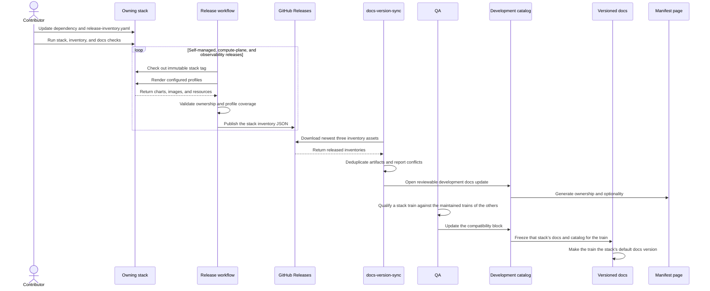

# Stack Inventory Flow

## Summary

We package the self-managed control plane, compute plane, and observability
stack as three separate distributables. Each stack owns the inventory of
charts, images, and resources that its release can cause a customer environment
to pull. Release automation publishes those inventories as separate assets,
then the documentation sync combines them into one customer-facing manifest.

This split keeps ownership close to the stack that installs the dependency.
Each stack is packaged, tagged, inventoried, and documented independently, on
its own release trains. Which trains run together is recorded in the
compatibility matrix, not implied by a shared version.

## Architecture

The flow has three layers:

1. Each directory under `deploy/stacks/` owns its Helmfile states and
   `release-inventory.yaml`. An inventory config must reference only states
   under that stack directory.
1. The release workflow checks out an immutable stack tag, renders the profiles
   named by that stack, and publishes one resolved JSON inventory with the
   matching GitHub Release. The publishing stack is resolved from the tag
   alone, so a tag cut from a `release-deploy/stacks/<stack>/vX.Y` branch
   attaches its inventory the same way.
1. `tools/docs-version-sync` downloads all three released inventories. It
   validates their plane boundaries, merges compatible artifacts, updates
   `docs/version-catalog/main.yaml`, and generates the inventory blocks in
   `docs/overview/manifest.md` and the compatibility matrix in
   `docs/overview/compatibility-matrix.md`.
1. The catalog records the latest released control-plane, compute-plane, and
   observability versions, and the `compatibility:` block records which trains
   run together. Each stack's documentation is frozen on its own when its
   train first releases.

The version catalog is the handoff between release facts and public
documentation. Released inventories provide immutable versions and source
provenance. The catalog adds public distribution locations and the
human-authored descriptions and source links. Stack ownership and
required or optional status come from the released inventories.

At the current phase, CI reports drift from the latest released inventories as
a warning. We still block on locally generated documentation being out of sync.
This gives the team visibility while the three release assets are being adopted
without making an unavailable or older release asset stop unrelated changes.

## Release Sequence



## Ownership Model

Keep each fact in one source:

- The owning Helmfile and chart values define runtime dependencies and versions.
- Each stack's `release-inventory.yaml` supplies release-time inventory
  configuration that cannot be derived from an ordinary render.
- The resolved JSON inventory records the artifacts found at an immutable stack
  tag. Release automation publishes it with the stack release.
- The catalog records the latest released version of each stack and, in the
  `compatibility:` block, which trains run together.
- `docs/version-catalog/main.yaml` records public distribution locations and
  human-authored descriptions and source links.
- Generated blocks in `docs/overview/manifest.md` and
  `docs/overview/compatibility-matrix.md` present the catalog to users.

Do not maintain a second hand-written list of versions in the documentation.

## What Belongs in an Inventory

Include every artifact that the stack can cause a customer cluster to pull:

- The stack bundle.
- Helm charts installed by the stack.
- Images in containers and init containers.
- Images used by Helm hooks.
- Images created later by an operator or controller.
- Images passed through command arguments or configuration instead of a
  Kubernetes `image` field.
- Downloadable resources distributed as part of the stack.

An ACME HTTP-01 solver image is one example of an indirect image. A controller
creates its short-lived workload only when an ACME challenge is requested, so
a normal default workload list might not contain the image. The inventory
renderer also scans resolved command arguments shaped like `--*-image=<ref>`
for this reason. If a new dependency uses another indirect form, extend the
renderer and cover that form with a test.

## Required and Optional Rules

Use the default supported installation as the boundary:

- `required`: The default installation needs the artifact to become ready or
  perform its baseline function.
- `optional`: The artifact is needed only when a feature, provider, add-on, or
  non-default mode is enabled.

An image required by an optional component is still optional at the stack
level. Record the condition or feature that activates it in the artifact
description. Customer-provided cluster prerequisites are not distributed stack
artifacts. Document them as prerequisites instead.

## Contributor Flow

When adding, removing, or changing a dependency:

1. Change the owning Helmfile, values, or chart configuration.
2. Add an explicit condition for an optional release.
3. Update the state in the owning stack's `release-inventory.yaml`.
   Add the optional setting to its `fullOverrides`, or add a state entry when
   the dependency belongs to a new Helmfile state.
4. Add a `sourceCharts` entry when an independently released chart must be
   rendered from an immutable source tag. Update the renderer when an indirect
   artifact uses an input form it does not recognize.
5. Add or update tests that prove the resolved inventory contains the artifact
   and its source release. Confirm the inventory-derived stack ownership and
   required or optional status.
6. Update `manifest.entries` in `docs/version-catalog/main.yaml`. Set the plane,
   kind, public description, and public source link. The released inventory
   overrides ownership and required or optional status.
7. For a new third-party dependency, verify its license against
   `.allowed-licenses.txt` and update `NOTICE` or subtree attribution files as
   required.
8. Run:

   ```bash
   make -C deploy/stacks/self-managed test
   make -C deploy/stacks/nvcf-compute-plane test-local
   make -C deploy/stacks/observability test
   go test -C tools/docs-version-sync ./...
   go vet -C tools/docs-version-sync ./...
   go run -C tools/docs-version-sync . --target main
   ./tools/ci/check-doc-version-sync
   ./tools/ci/check-docs
   ```

The renderer rejects unclassified artifacts. Inventory generation warns when a
release declared in a Helmfile state does not appear in its full profile. Do
not denylist an artifact merely because its public publication is pending.

## Release Packaging

The release workflow generates each inventory from its immutable stack tag. It
renders the configured profiles, collects charts and ordinary images,
discovers supported indirect image references, validates the result, and
attaches the matching inventory JSON to that stack's GitHub Release.

The generation command has this shape:

```bash
go run -C tools/docs-version-sync . \
  --generate-stack-inventory /tmp/stack-inventory.json \
  --inventory-config deploy/stacks/<stack>/release-inventory.yaml \
  --stack-version X.Y.Z \
  --stack-source-tag deploy/stacks/<stack>/vX.Y.Z \
  --stack-source-commit <full-commit-sha>
```

Generation requires the tagged source, Helm and Helmfile, and release registry
credentials. It normally runs in `.github/workflows/release-tags.yml`. Do not
put credentials in repository files or command examples.

The manual `inventory_tag` preflight uploads the rendered JSON as a workflow
artifact. New releases use the inventory config stored in the immutable tag.
For a release that lacks a config with per-stack states, the preflight uses the
config from the workflow ref as a bootstrap. The inventory still records and
renders the selected tag. It uses source charts available in the historical
commit and falls back to a published chart when its source path did not exist
yet. This fallback is only for validating historical releases. Tags created
after this workflow lands are self-contained.

## Development Documentation Sync

After stable releases and inventory assets exist for all three stacks, run:

```bash
git fetch --tags origin
go run -C tools/docs-version-sync . --target main --update-catalog
go run -C tools/docs-version-sync . --target main
go test -C tools/docs-version-sync ./...
./tools/ci/check-doc-version-sync
./tools/ci/check-docs
```

By default the update selects the latest stable release of each stack. The
update is reviewable and does not by itself change the `compatibility:` block,
which is maintained by hand when qualification results change.

The catalog update retains an exact publication only when its artifact name,
type, and version still match. Leave an artifact in `publication_pending` until
its public location has been verified. Do not hand-edit generated manifest
blocks.

The CI check against the latest released inventory remains warn-only for now. A
release-drift warning does not block a merge. Generated-document consistency
remains blocking, and local validation should still return success before a
dependency change is complete.

## Per-Stack Documentation Freeze

After a train's first release for one stack, and after its customer artifacts
are published, update the `compatibility:` block if the qualification result
changed, sync, then freeze that stack's docs alone:

```bash
go run -C tools/docs-version-sync . --target main --update-catalog
go run -C tools/docs-version-sync . --target main
./tools/scripts/cut-docs-version.sh --stack <self-managed|compute-plane|observability> --train X.Y
```

The freeze copies only that stack's documentation tree and catalog snapshot
and adds the train to that stack's version list. The other two stacks are not
touched. A later development sync moves `docs/<stack>/` forward without
changing the frozen tree. See `tools/docs-version-sync/README.md` for the
exact flags.

## Compare Release Sets

Place the previous inventory JSON files in one directory and the current files
in another. A directory can contain one historical combined inventory or three
separated inventories. Run:

```bash
go run -C tools/docs-version-sync . \
  --compare-release-set-from /tmp/previous-inventories \
  --compare-release-set-to /tmp/current-inventories
```

The report lists added, removed, and changed artifacts. Changes include image
or chart references, digests, stack ownership, and required or optional status.
