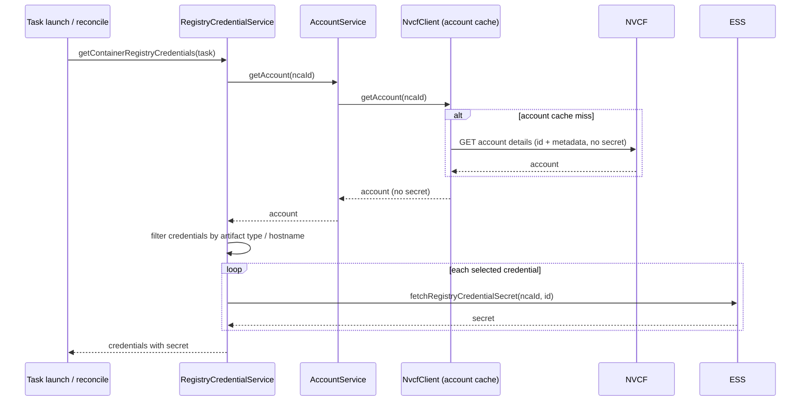
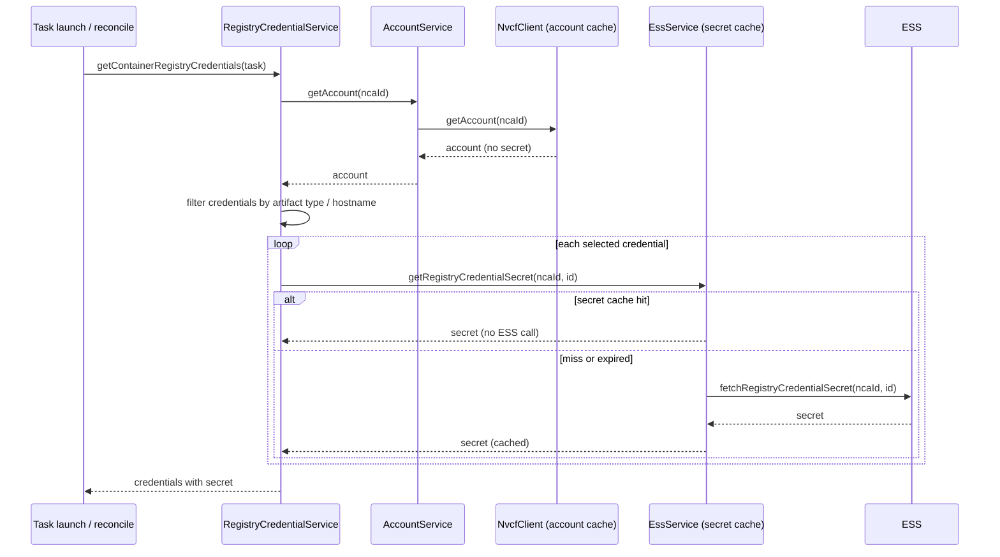
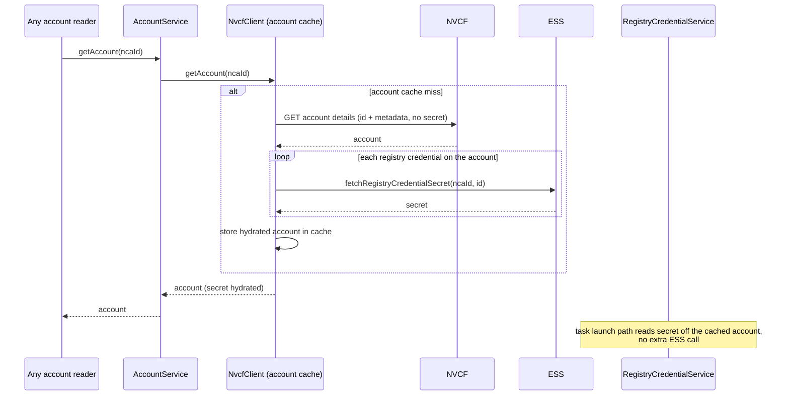

# NVCT registry credential secret caching design

Status: draft for internal review
Owner: NVCT
Scope: cloud-tasks (NVCT) secret resolution after phase 2

## Why

Phase 2 changes the Get Account Details contract. NVCF no longer returns the
registry credential secret in the response. It returns only the registry
credential id plus metadata. NVCT now resolves the secret from ESS by
`(ncaId, registryCredentialId)`.

Before phase 2, NVCT cached the account response in `NvcfClient`
(`cachedNvcfAccounts`, TTL 15m). The secret rode inside that response, so
caching the secret was a passive side effect of caching the account. After
phase 2 the response has no secret, so that implicit caching is gone. Without a
new cache, NVCT would call ESS for every registry credential on every task
launch and reconcile.

This document compares two caching options and recommends one.

## Current data flow after phase 2 (no cache)



Problem: the ESS call in the loop runs on every request. There is no cache.

## Option A: dedicated registry credential secret cache

Add a `LoadingCache<(ncaId, registryCredentialId), SecretDto>` inside the secret
resolution path (`EssService.getRegistryCredentialSecret`). ESS is called only on a cache miss or
after the entry expires. Missing secrets are not cached, so a later ESS write is
picked up on the next call. The secret cache has its own TTL (proposed 5m) and
its own metrics.

The account fetch path is unchanged. ESS is reached only from the registry and
task launch path, which is the only path that needs the secret.



## Option B: reuse the NvcfClient account cache

Hydrate the secret into the account at account load time. `NvcfClient` fetches
the account from NVCF, then calls ESS for each registry credential and stores
the hydrated account in `cachedNvcfAccounts`. Downstream callers read the secret
off the cached account, so there is one cache and the secret TTL equals the
account TTL (15m). This is the closest match to pre-phase-2 behavior.



## Tradeoffs

| Dimension | Option A dedicated secret cache | Option B reuse account cache |
|---|---|---|
| ESS call site | Registry / task launch path only | Every account load, for all credentials |
| Blast radius | Narrow, isolated to secret resolution | Broad, every account reader depends on ESS |
| ESS outage impact | Only secret resolution fails | Account load fails, so all account readers fail |
| Secret TTL | Independent, proposed 5m | Tied to account TTL, 15m |
| Fetch shape | Lazy, only credentials a task needs | Eager, all account credentials |
| Separation of concerns | NvcfClient stays NVCF only | ESS coupled into NvcfClient |
| Closeness to old behavior | Equivalent effect, different boundary | Closest, secret cached with the account |
| New moving parts | One new cache with metrics | No new cache, extra load step |

## Test and prod impact

Option A: the full nvct-core suite passed with the dedicated cache in place.

Option B: hydrating at account load made account fetch call ESS for every
caller. The nvct-core suite ran 677 tests with 67 failures. All failures share
the same cause: account readers that never provisioned an ESS mock now hit ESS
and get connection refused, so endpoints return 500.

Example failure (`MonitorQueuedTasksRoutineTest`, a scheduler test that does not
start an ESS mock):

```text
=> Exception: WebClientRequestException: Connection refused: localhost:9098
   Request to GET http://localhost:9098/v1/accounts/test-nca-id/registry-credentials/<id>
   at NvcfClient.hydrateRegistryCredentialSecrets(NvcfClient.java)
```

This is not a missing test mock. It reflects the design: Option B makes every
account read require ESS, including schedulers, task detail, filter, and misc
endpoints. In production this adds ESS latency and an ESS dependency to every
account read.

## Recommendation

Adopt Option A, the dedicated registry credential secret cache in the secret
resolution path (`EssService`).

Reasoning: the pre-phase-2 cache worked because NVCF pushed the secret inside
the account response. Once NVCF stops pushing it, NVCT must pull it. Pulling at
account load forces every account reader to pull, which is the broad blast
radius shown above. Pulling only where the secret is needed, and caching it
there, gives the same load reduction with a narrow, well isolated dependency.

## Open questions for review

- Secret cache TTL. Proposed 5m. Confirm against secret rotation and deletion
  expectations.
- Max entries. Proposed 3072. Confirm against the largest expected fan out of
  active registry credentials.
- Negative caching. Current proposal does not cache a missing secret so a
  delayed ESS write is picked up. Confirm this is acceptable given ESS load.
- Metrics and alerts. Confirm the cache hit ratio and ESS error metrics feed the
  dashboards the team already uses.
```
