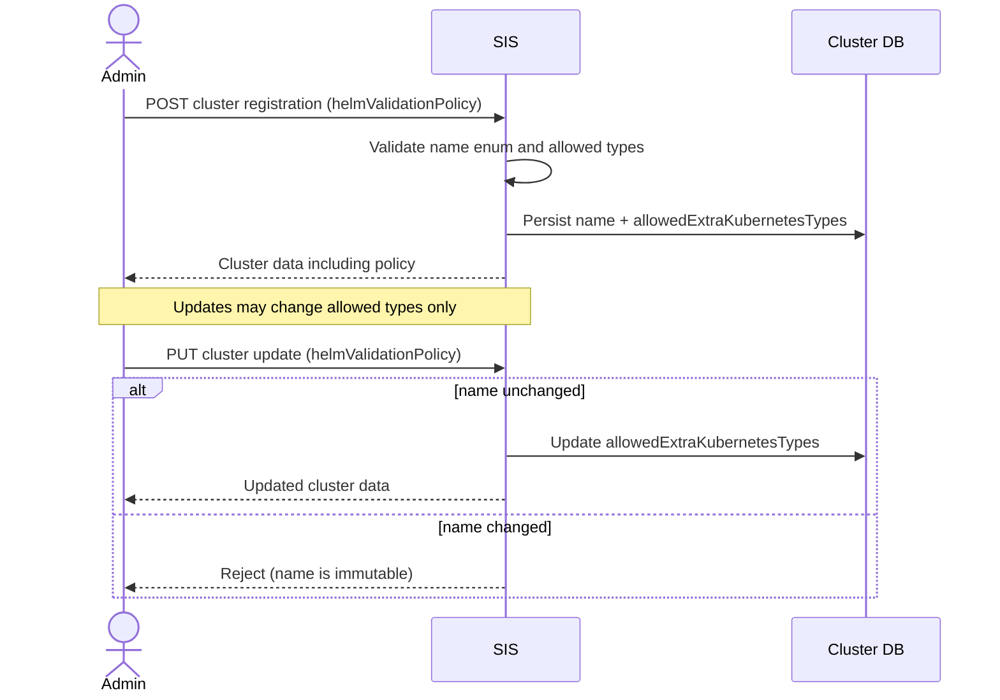
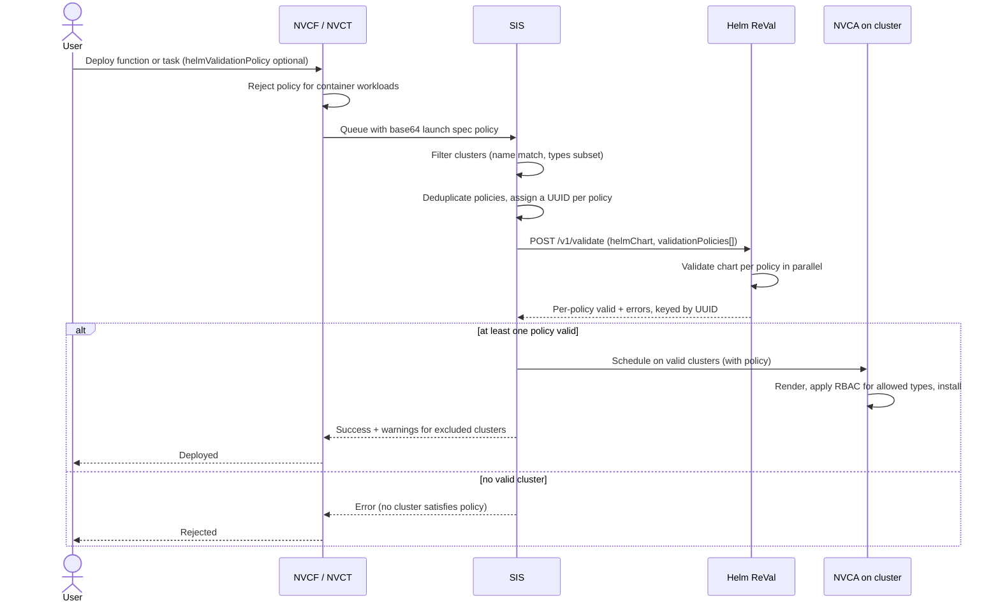
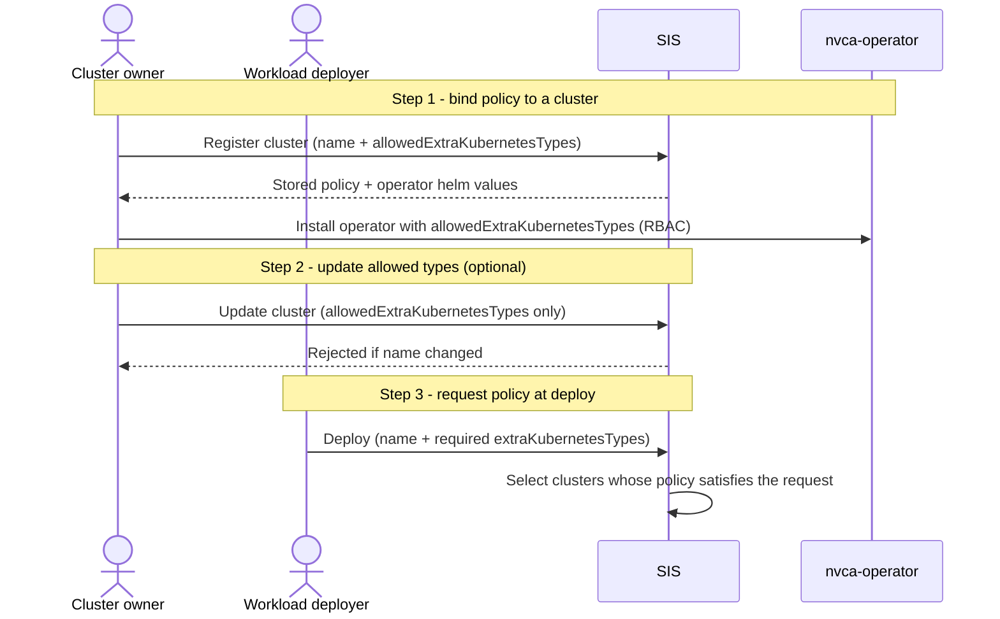
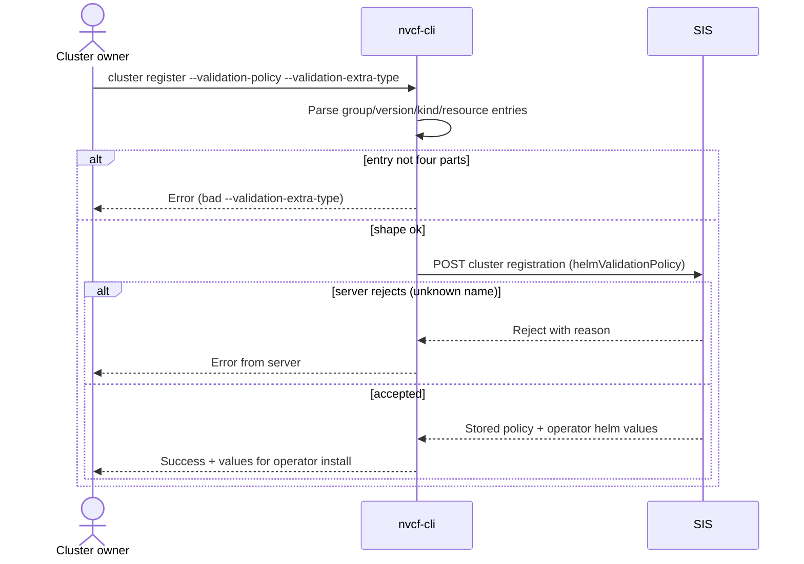
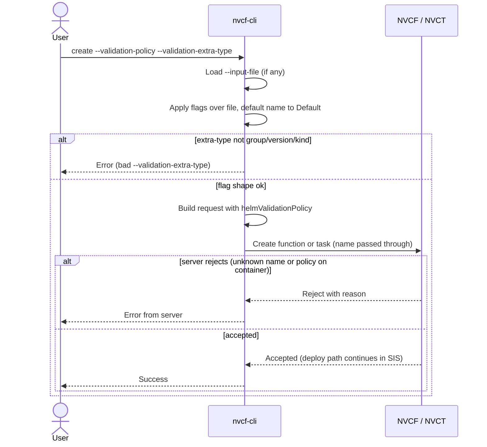

# NVCF BYOC Cluster Validation Policy

## Problem

Helm ReVal renders and validates customer Helm charts before they deploy to BYOC
clusters as NVCF functions or NVCT tasks. Today every cluster gets the same
validation rules, and ReVal has no idea which cluster a chart targets. Two gaps
result:

- Clusters with different security postures (single vs multi tenant) cannot get
  different restriction levels.
- Clusters running operators that add CRDs (for example LeaderWorkerSet from NIM
  Factory) cannot accept charts that reference those custom types, because ReVal
  rejects unknown Kubernetes types.

## Solution in one sentence

Attach a per-cluster validation policy that controls how strictly ReVal
validates a chart and which extra CRD types the chart may use, and let workload
deployers request a matching policy at deploy time.

## Core concept: the validation policy

A validation policy has two parts:

- name: an enum, either Default or Unrestricted.
  - Default: current ReVal rules apply. This is the default for every cluster.
  - Unrestricted: no template validation, only image validation.
- allowedExtraKubernetesTypes: a list of extra types the chart may include, each
  described by group, version, kind, and resource.

A policy is identified by its name plus its ordered list of allowed types.

## How it works end to end

1. Cluster registration. An admin registers a cluster with a policy. SIS stores
   it and returns it on every endpoint that returns cluster data. The policy is
   immutable after registration, except that allowedExtraKubernetesTypes may be
   updated; the name cannot change.
2. Workload deploy. A user optionally sets helmValidationPolicy on the function
   or task spec (a name and/or a list of required extra types). NVCF/NVCT base64
   encode this and pass it to SIS in the launch specification.
3. Cluster filtering. SIS filters clusters by the request policy. Required types
   must be a subset of the cluster's allowed types, and the name must match.
   Unrestricted clusters are selected only when the user explicitly asks for
   them.
4. Validation. SIS calls ReVal once per request with the deduplicated set of
   policies across the filtered clusters. ReVal returns per-policy valid or
   invalid plus errors, keyed by a caller-supplied UUID.
5. Install. For valid clusters, NVCA renders and installs the chart. The
   operator grants RBAC for the allowed types so the on-cluster controller can
   reconcile the custom objects.

## Sequence: cluster registration with a policy



## Sequence: workload deploy with a policy



## Changes by component

Helm ReVal
- /v1/validate accepts a validationPolicies list and returns per-policy results
  keyed by UUID.
- /v1/render accepts a single validationPolicy.
- Objects matching an allowed extra type skip template validation and pass
  through as-is.
- Runs as a standalone control-plane service for Self-Hosted, with JWT auth.
- Adds unified cross-pod caching to bound latency on the scheduling path.

SIS (Spot Instance Service)
- Accepts helmValidationPolicy on cluster registration and update; persists name
  and allowed types in the cluster tables; defaults all clusters to Default with
  no extra types.
- Returns the policy on all endpoints that return cluster data.
- Rejects name changes after registration; allows only
  allowedExtraKubernetesTypes updates.
- Moves the ReVal /v1/validate call out of NVCF/NVCT into SIS, called once per
  request.
- Filters clusters by the launch-spec policy and adds a warnings field for
  clusters excluded by policy mismatch.

NVCF (functions) and NVCT (tasks)
- Accept helmValidationPolicy (name plus extraKubernetesTypes) on the deployment
  spec.
- Reject the field for container-based functions and tasks; it is Helm only.
- Base64 encode the policy and pass it to SIS via the launch specification.

NVCA and NVCA Operator
- Add allowedExtraKubernetesTypes to operator Helm values and validate them
  against the cluster policy.
- Add the allowed types to the nvca Role and to the mini-service-restrictions
  Role in the nvca-miniservice-rbac ConfigMap.
- Store the policy on the NVCFBackend object and pass it to NVCA via the agent
  config ConfigMap; a change triggers an NVCA rollout.
- On startup, verify each allowed type is present on the cluster; if a CRD is
  missing, report unhealthy and exit to prevent mid-deploy failures.

CLI (nvcf-cli)
- Add discrete flags to task create and deploy create so the policy no longer
  requires hand-editing the --input-file JSON payload. See the CLI section below
  for details.

## API shape (deploy path)

The type list on the deploy path uses group, version, and kind.

```json
{
  "gpuSpecification": {
    "gpu": "T10",
    "instanceType": "g6.full",
    "helmValidationPolicy": {
      "name": "Unrestricted",
      "extraKubernetesTypes": [
        { "group": "foo.bar.io", "version": "v1", "kind": "MyKind" }
      ]
    }
  }
}
```

## API shape (ReVal validate)

Cluster policies are deduplicated by callers, so each policy carries a UUID to
map results back to clusters.

```json
{
  "helmChart": "https://foo.com/mychart-0.1.0.tgz",
  "validationPolicies": [
    {
      "id": "0a89e1aa-96b1-455f-9413-38776819e89b",
      "name": "Unrestricted",
      "allowedExtraKubernetesTypes": [
        { "group": "foo.bar.io", "version": "v1", "kind": "MyKind", "resource": "mykinds" }
      ]
    }
  ]
}
```

The response returns a top-level valid plus a per-policy result list with id,
valid, and validationErrors.

## Policy lifecycle

A policy is not a standalone object that you create once and reference by id.
There are two layers and two audiences.

Layers
- Policy names: the enum (Default, Unrestricted, and any future name). Defined in
  SIS config, server-side, for out-of-tree updates. Not created via API or CLI.
- A cluster's concrete policy: a name plus its allowedExtraKubernetesTypes. Bound
  to a cluster at registration and stored by SIS.

Steps
1. Bind a policy to a cluster (cluster owner). Register the cluster with a name
   and allowedExtraKubernetesTypes. This records the policy in SIS and, on the
   compute plane, drives the operator RBAC for those types. The name is immutable
   after registration.
2. Update allowed types (cluster owner, optional). Only allowedExtraKubernetesTypes
   can change later. The name cannot change.
3. Request a policy at deploy (workload deployer). A function or task inlines the
   policy it wants (one name plus required extraKubernetesTypes). SIS matches
   clusters whose stored policy satisfies the request.

Field-shape difference
- Cluster side (allowedExtraKubernetesTypes): group, version, kind, resource.
- Workload side (extraKubernetesTypes): group, version, kind.



## CLI (nvcf-cli)

The CLI serves both audiences. A cluster owner binds a policy at registration.
A workload deployer requests a policy at create. The CLI only builds the request
body; the policy still travels the normal control-plane path.

Scope
- cluster register: add policy flags now (Step 1). cluster register already
  exists and calls POST /v1/accounts/{ncaId}/clusters; it gains the policy field.
- task create and deploy create: add policy flags now (Step 3).
- deploy update is deferred until the PATCH gpu-specification contract is
  confirmed to accept helmValidationPolicy. The design shows the field only on
  the create path today.
- Updating a cluster's allowed types after registration (Step 2) has no CLI home
  today: only cluster rotate (JWKS) and cluster delete exist. Tracked as a
  follow-up below.

Flags (task create and deploy create, Step 3)
- --validation-policy: policy name. Sets helmValidationPolicy.name. Default and
  Unrestricted are the names that exist today, but SIS treats the allowed set as
  server-configured, so the CLI passes the value through rather than enforcing a
  fixed enum. See Client-side validation below.
- --validation-extra-type: repeatable, format group/version/kind (for example
  leaderworkerset.x-k8s.io/v1/LeaderWorkerSet). Each entry must have all three
  parts. Populates extraKubernetesTypes.

Flags (cluster register, Step 1)
- --validation-policy: policy name bound to the cluster.
- --validation-extra-type: repeatable, format group/version/kind/resource (four
  parts, note the extra resource). Populates allowedExtraKubernetesTypes.

Merge and precedence
- Flags override --input-file, matching the existing CLI pattern.
- --validation-policy overrides the name from the file.
- Any --validation-extra-type entries replace the file's list.
- If only extra types are given, name defaults to Default.

Client-side validation
- The CLI does not hardcode the allowed policy names. SIS configures the valid
  set in its config file for out-of-tree updates, so the CLI passes the name
  through and SIS validates it. This avoids needing a CLI release when a new
  policy name is added server-side.
- The CLI still checks flag shape: --validation-extra-type must have all parts
  present (three on the workload side, four on the cluster side).
- The Helm-only rule is enforced by the server. The CLI does not always know if
  a function version is Helm-based at deploy time, so it does not guard that.

Client DTO changes
- Reuse HelmValidationPolicyDto from internal/client/tasks.go for the workload
  side; add HelmValidationPolicy to the function-side GPUSpecificationDto in
  internal/client/client.go so deploy create can carry it.
- Add an optional resource field to KubernetesType (omitempty) so the same type
  serves the cluster side (four fields) and the workload side (three fields).
- Add HelmValidationPolicy (name plus allowedExtraKubernetesTypes) to
  RegisterClusterRequest in internal/client/clusters.go for cluster register.
- Task DTOs already model the workload policy; task create only needs the new
  flags and merge logic.

Examples

```sh
# Step 1: bind a policy to a cluster at registration
nvcf-cli cluster register \
  --name my-cluster --nca-id <nca> --region us-west-1 \
  --validation-policy Unrestricted \
  --validation-extra-type leaderworkerset.x-k8s.io/v1/LeaderWorkerSet/leaderworkersets

# Step 3: task requests an unrestricted policy and one extra type
nvcf-cli task create \
  --name my-training-job \
  --gpu H100 --instance-type GPU.H100_1x \
  --validation-policy Unrestricted \
  --validation-extra-type leaderworkerset.x-k8s.io/v1/LeaderWorkerSet

# Step 3: function deployment with the default policy
nvcf-cli deploy create \
  --function-id <id> --version-id <version> \
  --gpu H100 --instance-type NCP.GPU.H100_1x \
  --validation-policy Default
```

## Sequence: CLI cluster register (Step 1)



## Sequence: CLI create (Step 3)



## Rollout and compatibility

- Every existing cluster defaults to Default with no extra types, so behavior is
  unchanged.
- The feature is opt-in from both sides: a cluster owner must loosen a cluster,
  and a deployer must explicitly target it.
- If no policy name is set on a request, it defaults to Default.

## Security

- Default remains Default with no allowed extra types; existing deployments are
  unaffected.
- Loosening a cluster requires an explicit, immutable choice at registration to
  avoid race conditions and privilege drift.
- Unrestricted clusters are never selected unless the deployer asks for them by
  name.

## Follow-ups

- No CLI command updates a cluster's allowedExtraKubernetesTypes after
  registration (Step 2). Only cluster rotate and cluster delete exist today.
  Adding a cluster update path (name immutable, allowed types editable) is
  tracked as separate work.
- deploy update policy support depends on the PATCH gpu-specification contract
  accepting helmValidationPolicy; confirm before implementing.

## Out of scope

- Account-level validation policies (tracked separately).
- Installing the operators that provide the extra CRDs.
- UI changes for calling ReVal.

## Reference

- GitHub issue: https://github.com/NVIDIA/nvcf/issues/880
