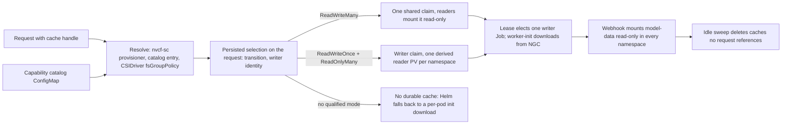
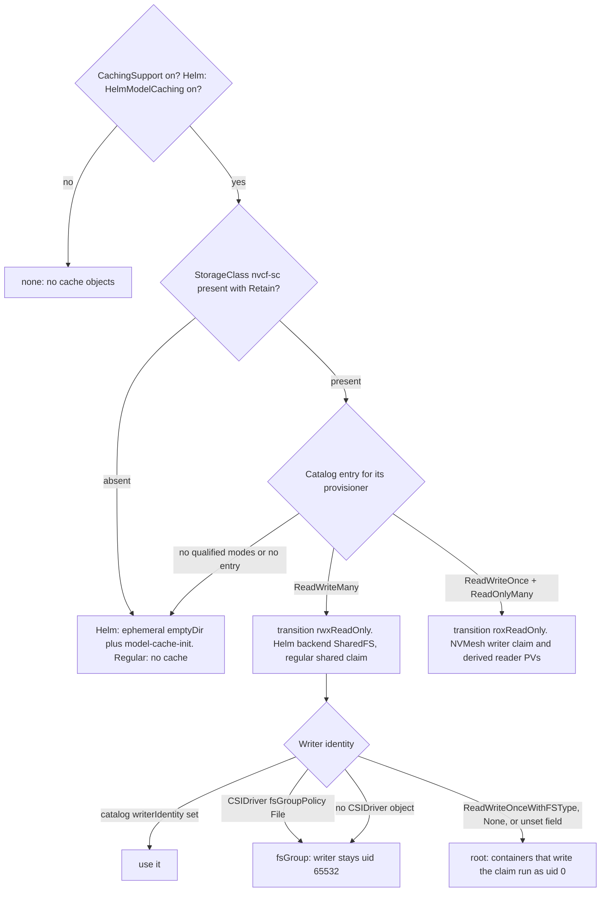
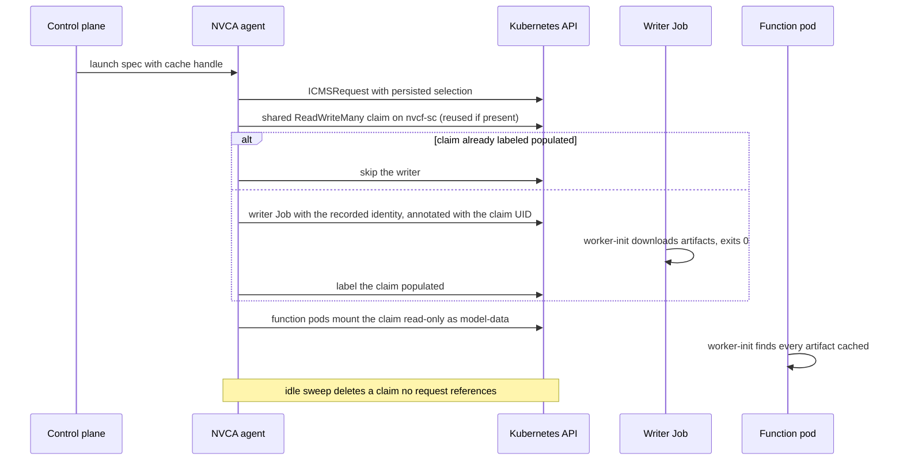

# SDD: Storage-Agnostic Model Cache

## Goal

Make NVCA model caching work on any storage backend that supports a minimum set
of PVC access modes, and make enabling a backend a data change rather than a
code change. Today NVCA picks a backend by StorageClass name, and the NVMesh
path has its provisioner, mount options, and namespace rewriting compiled in.

## How it fits together





Four pieces:

1. StorageClass contract. Deployment tooling renders one provider as
   `StorageClass/nvcf-sc` with reclaim policy `Retain`. NVCA reads only its
   provisioner.
2. Capability catalog. Per exact CSI provisioner, the access modes qualified in a
   cache workflow and the mount options for reader PVs NVCA creates. NVCA derives
   the flow; the catalog declares none.
3. Cache binding. One `ModelCacheBinding` per shared cache records the decision,
   the resources it owns, and the requests using it. A later catalog edit never
   changes a live cache.
4. Derived readers. A reader PV is derived from the writer's bound volume, never
   provisioned from the class.

## Terms

| Term | Meaning |
|---|---|
| Provisioner | Exact `StorageClass.provisioner` string, the catalog key |
| Workflow | `regularModelCache` (readers in the request namespace) or `helmModelCache` (readers in other namespaces) |
| Flow | How a cache moves from writer to readers, derived from access modes: `rwxReadOnly` or `roxReadOnly` |
| Cache handle | Content hash identifying one model cache |
| Writer | The single Job that populates a cache, serialized by a Lease. It runs non-root and relies on the pod fsGroup. On a shared claim NVCA records a writer identity when it selects storage: fsGroup when the live CSIDriver declares `fsGroupPolicy: File` (Weka), root when it declares ReadWriteOnceWithFSType or None (OCI FSS, a default NetApp Trident install), because those skip ReadWriteMany volumes and leave a fresh claim's root owned by root. Only the containers that write the claim are elevated; readers stay read-only and unprivileged |
| Reader | A namespace-local read-only volume onto the same data |

## Backend selection

The selection is made once, when NVCA creates the ICMSRequest, and persisted
on it. Everything downstream follows the persisted selection, so a catalog or
class change never moves a live cache.



A request created before selections existed carries none. Helm then falls
back to the StorageClass-presence order: `nvcf-sc-30` selects NVMesh,
`nvcf-miniservice-sc` selects SharedFS, `HelmSharedStorage` selects Samba,
otherwise ephemeral. An existing model-cache StorageRequest pins the backend
it was created with.

## Capability catalog

Installed by the NVCA chart as ConfigMap `nvcf-storage-capabilities` in the
operator's namespace; the operator mirrors it into the agent's namespace, where
the agent and the storage controller read it, and re-mirrors on every edit. A
copy of the shipped catalog is compiled into NVCA and used only while the
ConfigMap is absent. Validated by a packaged JSON Schema and by the Go loader
with the same rules.

```yaml
drivers:
  - name: nvmesh-csi.excelero.com
    provider: nvmesh
    accessModes: [ReadWriteOnce, ReadOnlyMany]
    readerMountOptions: [ro, norecovery, nouuid]
    encryptionSupported: true
  - name: csi.weka.io
    provider: weka
    accessModes: [ReadWriteMany]
    readerMountOptions: []
  - name: csi.trident.netapp.io
    provider: netappTrident
    accessModes: [ReadWriteMany]
    readerMountOptions: []
```

Drivers are a list named by exact provisioner, following Kubernetes API
conventions for stable ordering and diffs; the loader indexes them by name and
rejects duplicates. `encryptionSupported` records that an encrypted cache has
been qualified on the driver. It is a capability, not a switch: the
`ModelCacheEncryption` feature flag decides whether to encrypt, and only a
driver that lists support can be. `writerIdentity` is the one optional
override: `fsGroup` forbids a root writer on the driver, `root` requires one
when no CSIDriver object is registered. Absent, NVCA decides from the live
CSIDriver's `fsGroupPolicy`, and the decision is persisted on the request so
an upgrade never changes how an existing claim's writer runs. Today only the `ReadWriteOnce` plus
`ReadOnlyMany` shape implements encryption.

The catalog is a ConfigMap rather than a custom resource because it is release
data, not runtime state: the chart ships it, a JSON schema validates it in CI,
nothing reconciles or writes it on a cluster, and an operator edits it to enable
a backend. A custom resource would add install ordering and a schema version to
manage for a file. The cache binding, which is runtime state with a lifecycle,
is the custom resource.

| Qualified modes | Derived flow |
|---|---|
| `ReadWriteMany` | `rwxReadOnly`: one shared claim, readers mount it read-only |
| `ReadWriteOnce` and `ReadOnlyMany` | `roxReadOnly`: writer takes the claim, each namespace gets a reader PV derived from its volume |
| empty | off |

Two rules, enforced by schema and validator alike:

- The `ReadWriteOnce` plus `ReadOnlyMany` shape must list `ro`. NVCA creates
  those reader PVs and must mount them read-only.
- `ReadOnlyMany` with no writer mode is rejected. Nothing would populate the cache.

Everything else is data. `norecovery` and `nouuid` are NVMesh XFS requirements
recorded on the NVMesh entry only. `provider` is a label for diagnostics and
gates nothing. Helm caching must cross namespaces: `ReadWriteMany` does so
natively; `roxReadOnly` does so only on NVMesh, whose volume handle encodes the
consuming namespace and is rewritten per reader.

## Cache binding

`ModelCacheBinding` (`nvca.nvcf.nvidia.io/v2beta1`) is namespaced in
`nvca-modelcache-init`, one per shared cache.

| Field | Records |
|---|---|
| `spec.identity` | Workflow, sharing-domain digest, cache-handle digest |
| `spec.decision` | Provider, provisioner, derived flow, required access modes, catalog profile digest |
| `spec.storageClass` | Name, UID, `Retain`, configuration digest |
| `spec.resources` | Names of the PVCs, PVs, Jobs, StorageClasses, Secrets, and Lease it owns |
| `status.requestReferences` | Namespace, name, and UID of each request using it |
| `status.phase` | `Active` or `Retiring` |

The API server enforces: `spec` is immutable, `Retiring` never returns to
`Active`, a recorded data identity never changes. A finalizer protects owned
resources until they are released.

Why an object and not annotations:

- Lifetime. The decision must outlive every request. A request annotation dies
  with its request; the binding lives as long as the cache.
- Identity per referrer. A timestamp cannot tell an idle cache from one held by
  a request that died without cleanup. UID references can. Zero references is
  the idle condition.
- Enforcement. Immutability and phase rules are rejected by the API server. A
  bad annotation write is accepted silently.

Lifecycle, in the runtime design: a binding with zero references past the idle
period moves to `Retiring`, the resources it names are deleted, and the
finalizer is dropped. Nothing it does not name is touched. Uninstall strips binding finalizers before
deleting the control namespace, and stops if it cannot, so the uninstall can be
retried instead of leaving the namespace Terminating.

## Readers

Every reader is a static PV pre-bound to a claim by name. The PV is a copy of
the writer's PV with: `storageClassName` cleared (a pre-bound pair whose classes
differ never binds), `csi.readOnly: true` (access modes are not enforced at
mount time), and `mountOptions` taken from the request's persisted selection,
which carries the catalog's `readerMountOptions`. Operator-configured options
are appended unless they negate a required one (`rw` against `ro`). A request
with no durable selection falls back to the per-provisioner
`nvca-cache-mount-options` ConfigMap, so in-flight legacy requests keep their
behavior. Only the volume handle differs by driver: NVMesh rewrites the
namespace segment; every other driver reuses the writer's handle unchanged.

A reader claim that names only a StorageClass gets a new empty volume from a
dynamic provisioner. It binds, the pod starts, and the model is missing. That
was the previous shared-filesystem reader.

## Runtime flow

The shared-claim flow on the regular workflow, as implemented:



Steps as implemented:

1. Gate on `CachingSupport` and, for Helm, `HelmModelCaching`. Persist `none`
   or `ephemeral` when selected.
2. Read `StorageClass/nvcf-sc`, require `Retain`, load the catalog, derive the
   transition from the provisioner's entry. For the shared-claim transition,
   read the CSIDriver and record the writer identity. No derivable flow: no
   durable cache.
3. Persist the selection on the request before any storage side effect.
4. Run the flow. Shared claim: one claim and one writer Job per cache handle in
   the request namespace; the claim's populated label is the durable marker.
   NVMesh: writer claim and Job, then one reader PV per namespace derived from
   the writer's volume. A Lease serializes writers for a handle.
5. Catalog, feature-gate, and StorageClass changes after step 3 never alter a
   request's selection. NVCA never switches a live cache to another provider.

The `ModelCacheBinding` CRD and clients exist; no controller creates a binding
yet. Garbage collection is an idle sweep keyed on a last-referenced
annotation, plus reclamation of retained shared-filesystem writer claims whose
handle has no referrer.

## What runs today

Verified on NVCA 3.13.3:

| Path | Behavior |
|---|---|
| Regular workflow, `ReadWriteMany` provisioner (OCI FSS qualified) | One shared claim per handle in the request namespace, writer Job runs as root where the CSIDriver skips fsGroup, claim labeled populated, worker pods report every artifact cached |
| Regular workflow, NVMesh | Writer claim and derived reader PVs; the primary is kept while a function serves from it |
| Helm workflow with a persisted selection | `rwxReadOnly` selects the SharedFS backend, `roxReadOnly` selects NVMesh, `ephemeral` injects an `emptyDir` and the `model-cache-init` container whose environment travels in the miniservice metadata ConfigMap |
| Helm workflow without a selection | StorageClass-presence order: `nvcf-sc-30`, `nvcf-miniservice-sc`, `HelmSharedStorage` Samba, ephemeral |
| Readers | The mutating webhook injects the reader claim as the `model-data` volume, mounted read-only, at `/config/models` and `/config/resources` |

Known gaps, tracked publicly:

- A writer Job whose pods are never admitted is reported in progress
  indefinitely, and the idle sweep can delete a claim while its Job still
  exists: [#2323](https://github.com/NVIDIA/nvcf/issues/2323).
- Cache claim sizing has no headroom for filesystem metadata, and a full
  volume is misreported as `job_not_found`:
  [#2233](https://github.com/NVIDIA/nvcf/issues/2233).
- The worker-init download rate is a typed cluster setting only once
  [#2364](https://github.com/NVIDIA/nvcf/pull/2364) ships.
- Shared-claim PVs use `Retain` and are not reclaimed by the storage-request PV
  collector, so released cache volumes accumulate.

## Qualification

A driver's advertised modes are not evidence, and a claim that binds is not
evidence. A run must show, on the exact provisioner and class:

1. A writer populates a claim and the data survives the writer exiting.
2. A reader in another namespace sees identical bytes (compare a hash).
3. Writes from a reader fail with `EROFS`: create, append, rename, chmod,
   truncate, delete. A `ro` mount flag alone is not proof.
4. Reclaim policy is `Retain`.

Measured on a Weka cluster and an OCI File Storage (FSS) cluster, 16 MiB
payload, SHA-256 compared:

| Reader | Weka | OCI FSS |
|---|---|---|
| Static PV on the writer volume, RWX claim, other namespace | hash matches, writes `EROFS` | hash matches, writes `EROFS` |
| Static PV on the writer volume, ROX claim, other namespace | hash matches, writes `EROFS` | hash matches, writes `EROFS` |
| Fresh dynamic claim on the same class | new volume, empty | new export, empty |

Both qualify for `ReadWriteMany` and `ReadOnlyMany` by the same mechanism.
Their catalog entries stay empty until a full cache workflow, not a synthetic
writer, has run on each. OCI Lustre is registered but unmeasured. FSS notes:
its driver declares `fsGroupPolicy: ReadWriteOnceWithFSType`, so a non-root
writer gets `EACCES` on a fresh export, and its stock classes use `Delete`, so
a `Retain` class must be created for the cache.

## Failure rules

| Event | Result |
|---|---|
| Catalog, class, or gate changes after the binding exists | Binding stays authoritative |
| Class or catalog drifts before the binding exists | Fail before any side effect |
| Catalog ConfigMap is absent (agent ahead of its chart) | Resolve against the catalog compiled into NVCA, warn, count; the ConfigMap is authoritative once present |
| Binding is `Retiring`, missing, or lacks this request's reference | Fail; never rebind |
| Object has foreign or missing ownership | Never adopt or delete it |
| Reader PV and claim disagree on class | Never binds; prevented by construction |
| Transient API error | Requeue without changing state |

Configuration drift never authorizes data deletion.

## Enabling a provider

1. Run the qualification on the exact provisioner and class.
2. Set the entry's `accessModes` to what the run proved, nothing more.
3. Set `readerMountOptions` if NVCA creates reader PVs for it; `ro` is required.
4. For a `ReadWriteMany` driver, record the `fsGroupPolicy` its CSIDriver
   declared during the run. Leave `writerIdentity` unset unless the live object
   cannot be trusted to carry it.
5. Regenerate the vendored chart so both catalog copies match.
6. Cite the run in the commit.

No code change should be needed. If one is, the catalog is missing a fact.

## Source references

- [Catalog](https://github.com/NVIDIA/nvcf/blob/main/deploy/helm/nvca-operator/nvca-operator/files/nvcf-storage-capabilities-v1alpha1.yaml)
- [Catalog schema](https://github.com/NVIDIA/nvcf/blob/main/deploy/helm/nvca-operator/nvca-operator/files/nvcf-storage-capabilities-v1alpha1.schema.json)
- [Catalog loader and validator](https://github.com/NVIDIA/nvcf/blob/main/src/compute-plane-services/nvca/pkg/storage/storage_capabilities.go)
- [Backend selection on main](https://github.com/NVIDIA/nvcf/blob/main/src/compute-plane-services/nvca/pkg/storage/cachebackend.go)
- [Runtime work](https://github.com/NVIDIA/nvcf/issues/1326)
