# NVIDIA Cloud Functions

This guide provides information for deploying and operating NVCF in self-managed environments.

- [Quickstart](./quickstart.md)
  : Install the control plane, register a GPU cluster, and validate the deployment with the one-click CLI flow.
- [Deployment](/nvcf/self-managed/installation-overview)
  : Compare the one-click and Helmfile installation paths.
- [GPU Cluster Setup](/nvcf/compute-plane/gpu-cluster-setup)
  : Connect GPU clusters to the NVCF control plane.
- [Configuration](/nvcf/self-managed/optional-enhancements)
  : Configure gateway routing, registries, and optional enhancements.
- [Using Cloud Functions](/nvcf/self-managed/api)
  : Create and invoke functions using the NVCF API and CLI.
- [Managed (Legacy)](../ngc-managed/cluster-management/ngc-managed.md)
  : Documentation for the legacy NGC-managed NVCF platform (BYOC).
