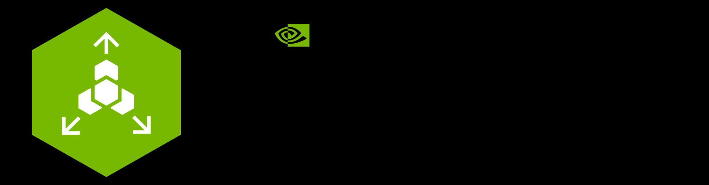

# NVIDIA Cloud Functions

{/*docs-version-sync:BEGIN edition-overview*/}

Docs edition `1.0.2`. Development candidate.

| Stack | Artifact version |
| --- | --- |
| Self-managed (control plane) | `1.0.1` |
| Compute plane | `1.0.0` |
| Observability | `1.0.0` |

The docs edition versions this documented combination. Each stack keeps its own artifact version.

{/*docs-version-sync:END edition-overview*/}

This guide provides information for deploying and operating NVCF in self-managed environments.

NVCF ships as three independently versioned Helm stacks. Each stack has its
own documentation set.

- [Self-Managed Stack](../self-managed/installation.md)
  : Control plane installation, configuration, function APIs, and operations.
- [Compute Plane Stack](../compute-plane/cluster-management/index.md)
  : GPU cluster setup, scheduling, and caches.
- [Observability Stack](../observability/observability.md)
  : Metrics, dashboards, and alerting.
- [Compatibility Matrix](./compatibility-matrix.md)
  : Stack releases that are qualified to run together.

## Getting started

- [Quickstart](./quickstart.md)
  : Install the control plane, register a GPU cluster, and validate the deployment with the one-click CLI flow.
- [Deployment](../self-managed/installation.md)
  : Compare the one-click and Helmfile installation paths.
- [GPU Cluster Setup](../compute-plane/cluster-management/index.md)
  : Connect GPU clusters to the NVCF control plane.
- [Configuration](../self-managed/gateway-routing.md)
  : Configure gateway routing, registries, and invocation options.
- [Using Cloud Functions](./api.md)
  : Create and invoke functions using the NVCF API and CLI.
