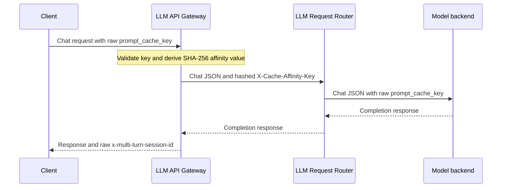

# LLM Gateway

The LLM Gateway handles OpenAI-compatible and native Anthropic Messages invocation for NVCF LLM functions in
self-managed deployments. Use LLM functions when requests should enter through
the LLM invocation route and NVCF should route them by function and model.

Self-managed deployments usually expose the LLM invocation route through the
gateway load balancer and use the `Host` header for routing:

```bash
export GATEWAY_ADDR=<gateway-address>
```

Requests use the `model` field in this format:

```text
<function-id>/<model-name>
```

The gateway uses `<function-id>` as the routing key for NVCF authorization and backend selection. It forwards `<model-name>` to the upstream model server.

Requests must use the native protocol for the selected endpoint when they reach the LLM invocation route. Any model-specific prompt formatting or tokenizer behavior belongs in the upstream model server.

## Request Flow

The LLM Gateway path has these runtime components:


1. Client sends a native protocol request to the LLM invocation route.
2. LLM API Gateway extracts the routing key from the `model` field, validates authorization, applies request and token rate limits, and validates endpoint-specific request fields.
3. LLM API Gateway forwards the request to LLM request router with routing metadata such as request ID, routing key, model name, routing method, token estimate, and cache affinity key when present.
4. LLM request router selects a healthy backend for the requested function and model.
5. The `pylon` sidecar on the selected workload forwards the request to the user container through the configured inference port.
6. The user container handles the selected route and returns the response through the same path.

The function container must expose the declared protocol paths on its inference port. Use `inferenceUrl: "/"` for LLM functions unless the container needs a different base path.

### Multi-Cluster View

In a global deployment, DNS or a custom front door selects a regional
`llm.invocation.<domain>` endpoint. The LLM Gateway can use NATS for
cross-cluster usage-state chatter. LLM worker request streams still use the
request router and worker gateway path, not NATS worker streams. The
worker-gateway arrows show that routers can target local or remote worker
gateways when those workers are registered into the router mesh.


## Function Configuration

Set `functionType` to `LLM` and define model routing metadata under `models[].llmConfig`.

```json
{
  "name": "sample-llm-function",
  "containerImage": "nvcr.io/example/openai-compatible:latest",
  "inferenceUrl": "/",
  "inferencePort": 8000,
  "functionType": "LLM",
  "apiBodyFormat": "CUSTOM",
  "models": [
    {
      "name": "dummy-model",
      "llmConfig": {
        "uris": ["/v1/chat/completions", "/v1/responses", "/v1/embeddings"],
        "routingMethod": "power_of_two",
        "tokenRateLimit": "1000-S"
      }
    }
  ]
}
```

`apiBodyFormat` accepts `CUSTOM` and `PREDICT_V2`; if omitted, it defaults to
`CUSTOM`. Use `CUSTOM` for LLM functions with native OpenAI or Anthropic Messages requests. `OPENAI_CHAT` is
not an accepted value and the create-function API rejects it with
`400 Bad Request`.

The body-format field does not select the LLM protocol or an OpenAI endpoint.
`functionType: "LLM"` selects the LLM invocation path, and `llmConfig.uris`
declares the paths implemented by the container. The client
request body uses the native protocol for the selected path; the
gateway does not wrap it in a second NVCF envelope.

`llmConfig.uris` declares the paths the model supports. Supported LLM paths are:

| Path | Behavior |
| --- | --- |
| `/v1/chat/completions` | Supports streaming and non-streaming chat completion requests. |
| `/v1/responses` | Supports native Responses API requests. Streaming clients receive server-sent events (SSE). Non-streaming clients receive the terminal Responses JSON object. |
| `/v1/embeddings` | Supports embeddings requests with string or string array input. |
| `/v1/messages` | Preserves native Anthropic Messages JSON responses and server-sent events, including tool and thinking content blocks. |

`nvcf-cli` accepts `round_robin`, `power_of_two`, `groq_multiregion`,
`pulsar`, or `random` for `llmConfig.routingMethod`.

For the mapping to Stargate algorithms and the request-router allowlist, see
[LLM Request Router Load Balancing](../self-managed/llm-request-router-load-balancing.md).

`llmConfig.tokenRateLimit` applies a per-model token limit. Use one or more comma-separated limits in `<value>-<unit>` format, where `<value>` is a positive integer and `<unit>` is one of `S` (seconds), `M` (minutes), `H` (hours), `D` (days), or `W` (weeks). A single limit is one token budget over one time window, such as `1000-S`. A combined limit is multiple token budgets over distinct time windows, such as `1000-S,5000-M,100000-H,500000-D,1000000-W`; do not repeat a unit in the same value.

The same configuration can be provided with CLI flags:

```bash
./nvcf-cli function create \
  --name "sample-llm-function" \
  --image "nvcr.io/example/openai-compatible:latest" \
  --inference-url "/" \
  --inference-port 8000 \
  --function-type LLM \
  --llm-model "name=dummy-model,uris=/v1/chat/completions|/v1/responses|/v1/embeddings,routingMethod=power_of_two,tokenRateLimit=1000-S"
```

These per-model routing fields are mutable. Use `nvcf-cli function update --llm-model-update "name=<model>,routingMethod=<method>,tokenRateLimit=<limit>"` or JSON `modelUpdates` to change them without recreating the function version.

For request admission and rate limiting, the gateway uses request estimates until the upstream service returns usage data. Do not depend on gateway-side exact token counts.

## Endpoint Behavior

### Chat Completions

Use `/v1/chat/completions` for OpenAI-compatible chat requests:

```bash
curl -sS -X POST "http://${GATEWAY_ADDR}/v1/chat/completions" \
  -H "Host: llm.invocation.${GATEWAY_ADDR}" \
  -H "Authorization: Bearer ${NVCF_API_KEY}" \
  -H "Content-Type: application/json" \
  -d '{
    "model": "<function-id>/dummy-model",
    "stream": true,
    "prompt_cache_key": "nvcf-summary-session",
    "messages": [
      {
        "role": "user",
        "content": "Write a one sentence summary of NVCF."
      }
    ]
  }'
```

When `stream` is `true`, the gateway relays server-sent events. When `stream` is false or omitted, the gateway returns the final JSON response from the upstream service.

For a non-streaming request, the upstream container must return an
OpenAI-compatible chat completion. For example:

```json
{
  "id": "chatcmpl-example",
  "object": "chat.completion",
  "created": 1787745600,
  "model": "dummy-model",
  "choices": [
    {
      "index": 0,
      "message": {
        "role": "assistant",
        "content": "NVCF routes GPU-backed inference workloads."
      },
      "finish_reason": "stop"
    }
  ],
  "usage": {
    "prompt_tokens": 12,
    "completion_tokens": 7,
    "total_tokens": 19
  }
}
```

For streaming requests, the upstream container returns OpenAI-compatible SSE
chunks and terminates with `data: [DONE]`. The gateway relays the upstream
response; it does not synthesize model output or token usage.

### Routing checks versus token-generation tests

An echo or fixed-response workload is useful for verifying function creation,
authentication, worker registration, routing, streaming transport, and
failover. It does not generate tokens. Repeated or canned output from such a
workload cannot measure model token throughput, time to first token, or
token-generation latency. Capacity and latency claims require a genuine
token-generating model, with input and output token counts recorded alongside
concurrency, duration, error rate, throughput, and latency percentiles.

### Responses

Use `/v1/responses` for native Responses API requests:

```bash
curl -sS -X POST "http://${GATEWAY_ADDR}/v1/responses" \
  -H "Host: llm.invocation.${GATEWAY_ADDR}" \
  -H "Authorization: Bearer ${NVCF_API_KEY}" \
  -H "Content-Type: application/json" \
  -d '{
    "model": "<function-id>/dummy-model",
    "input": "Write a one sentence summary of NVCF.",
    "stream": false
  }'
```

The gateway requires the routed model to declare `/v1/responses` in `llmConfig.uris` when model specs are available. The gateway proxies native Responses requests upstream instead of converting them to chat completions.

For upstream compatibility, the gateway sends native Responses requests to the router as streaming requests. If the client requested streaming, the gateway relays SSE. If the client requested a non-streaming response, the gateway consumes the upstream SSE stream and returns the terminal Responses JSON object.

### Embeddings

Use `/v1/embeddings` for OpenAI-compatible embeddings requests:

```bash
curl -sS -X POST "http://${GATEWAY_ADDR}/v1/embeddings" \
  -H "Host: llm.invocation.${GATEWAY_ADDR}" \
  -H "Authorization: Bearer ${NVCF_API_KEY}" \
  -H "Content-Type: application/json" \
  -d '{
    "model": "<function-id>/dummy-model",
    "input": "NVCF embeddings check"
  }'
```

The gateway accepts `input` as a string or an array of strings. Empty input is rejected. The request can include up to 2048 input entries.

Embeddings requests do not use session stickiness.

### Anthropic Messages

Use `/v1/messages` with a backend that implements the native Anthropic Messages
API. Add `/v1/messages` to that model's `llmConfig.uris`. The gateway does not
translate between Anthropic and OpenAI protocols.

```bash
curl -N -sS -X POST "http://${GATEWAY_ADDR}/v1/messages" \
  -H "Host: llm.invocation.${GATEWAY_ADDR}" \
  -H "Authorization: Bearer ${NVCF_API_KEY}" \
  -H "Content-Type: application/json" \
  -H "anthropic-version: 2023-06-01" \
  -H "x-multi-turn-session-id: messages-example" \
  -d '{
    "model": "<function-id>/dummy-model",
    "max_tokens": 256,
    "stream": true,
    "system": "Answer briefly.",
    "messages": [{"role": "user", "content": "Say hello."}]
  }'
```

Set `stream` to `false` or omit it for a native JSON response. The gateway
requires a positive `max_tokens` and a non-empty `messages` array. The backend
validates content blocks, tools, thinking settings, and beta feature support.
Upstream status codes, error bodies, and SSE event bytes pass through.

The gateway preserves `anthropic-version`, all `anthropic-beta` values,
`Content-Type`, `Accept`, `User-Agent`, and W3C trace headers. NVCF sets
`X-Request-Id` from its request context; backend response request IDs pass
through. It requests identity response encoding so usage can be observed without decoding
or changing the response. NVCF authentication uses `Authorization: Bearer`.
Credentials, internal routing headers, and other unlisted headers stop before
the model API. The gateway removes top-level `extra-headers` body members,
including letter-case and underscore variants. Native Anthropic `metadata` and
backend extension fields retain their JSON meaning. Request rewriting can
change key order and JSON escaping; request bytes are not preserved.

Admission fields (`model`, `max_tokens`, `stream`, `messages`, `system`, and
`tools`) require their canonical lowercase spelling. The gateway rejects
ambiguous duplicates so the backend and admission logic use the same values.
Messages use the existing authorization-resolved priority. Pylon strips inbound
engine priority headers before generating its own Dynamo priority headers.

Token admission estimates system, messages, and tools and reserves
`max_tokens` for output. `X-Input-Tokens` and `X-Token-Estimate` both describe
estimated input, as on other endpoints. JSON usage and streaming
`message_start` and `message_delta` usage reconcile the reservation. Streaming
counts are cumulative. Cached input counts are included in input accounting.

The observer skips JSON content without buffering it and reads top-level usage
even after a large content block. JSON usage, SSE line, and event data buffers
are bounded at 1 MiB; JSON nesting and key buffers are also bounded. Unsupported
encoding, oversized usage, malformed usage, and missing usage do not change
response delivery. Explicit identity encoding and LF, CRLF, and CR SSE line
endings are supported.

Only complete, valid usage releases unused output tokens. Streaming accounting
requires final output usage in `message_delta`, `message_stop`, and a clean
copy. After an accepted request, an interrupted or incomplete response retains
at least the full output reservation; observed input usage replaces its estimate
when valid. Reservations expire with the configured rate-limit window. A
request rejected before generation releases its output reservation. A transport
failure before response headers also retains output because the gateway cannot
prove that generation never started. Estimates are not reported as actual
tokens. Usage outcome counters and warnings expose
accounting fallbacks, and in-band SSE errors mark the stream as failed.

The existing `MODEL_URI_ALLOWLIST_ENABLED` mode applies to Messages: an
undeclared path is logged in the default mode and rejected in enforce mode.
An absent or empty URI list keeps the existing allowlist behavior.

For Vanity Gateway aliases, configure `v2config.anthropic.messages` on the
existing shared API host, configured by `v2config.openai.host`. The section supports the same model mapping, custom-header
validation, discovery, and shadow settings as other JSON endpoints. Shared
`/v1/models` discovery includes Messages aliases and adds `supported_endpoints`
to these aliases so clients can distinguish Messages-only models:

```json
{
  "v2config": {
    "openai": {
      "host": "api.example.com"
    },
    "anthropic": {
      "messages": {
        "native-model": {
          "modelName": "dummy-model",
          "functionID": "<function-id>",
          "functionType": "LLM"
        }
      }
    }
  }
}
```

For Claude Code, configure the invocation origin and pin both foreground and
background requests to a declared model:

```bash
export ANTHROPIC_BASE_URL="https://llm.invocation.example.com"
export ANTHROPIC_AUTH_TOKEN="${NVCF_API_KEY}"
export ANTHROPIC_MODEL="<function-id>/<model-name>"
export ANTHROPIC_DEFAULT_HAIKU_MODEL="${ANTHROPIC_MODEL}"
```

A Vanity Gateway alias uses its public model name. The gateway consumes the
native `x-claude-code-session-id` header for stable affinity across turns.
Clients without that header can set `ANTHROPIC_CUSTOM_HEADERS` to
`x-multi-turn-session-id: <unique-conversation-id>`. Use a different ID for each
conversation. See the [Claude Code gateway compatibility guide](https://code.claude.com/docs/en/llm-gateway-protocol).

The backend must accept the actual requests produced by the selected Claude
Code version, including its role layout, tool blocks, thinking settings, and
beta features. Claude Code 2.1.287 can include a `system` role inside `messages`,
which stock vLLM 0.20.1 rejects. The gateway preserves these roles. A hand-written native tool loop passing against
a backend does not prove Claude Code compatibility. Qualify the actual CLI and
SDK against the deployed backend. `/v1/messages/count_tokens` is not added by
this change.

This feature requires compatible LLM API Gateway, Stargate router, Pylon
worker, and Vanity Gateway builds. Upgrade Pylon workers first, then the router
and gateway builds, before enabling Messages routes. The new gateway removes
caller credentials before Stargate, including when an older worker is present;
older workers do not enforce the new backend metadata allowlist. Source support
does not establish availability in a published stack release. Release owners
must publish images and charts and update the self-managed and compute-plane
inventories and catalog after qualification.

## Model Routing And Upstream Paths

The client-facing `model` value must include a routing key and model name:

```text
<function-id>/<model-name>
```

The gateway uses `<function-id>` to authorize the request and select the NVCF function deployment. It rewrites the upstream model to `<model-name>` before forwarding the request.

The configured `llmConfig.uris` must match the paths served by the container. For example, a model that declares `/v1/responses` must have a container backend that can answer `POST /v1/responses`.

## Session Stickiness

The LLM Gateway supports sticky routing for multi-turn requests on `/v1/chat/completions`, `/v1/responses`, and `/v1/messages`.

Sticky routing is not supported on `/v1/embeddings`.

For Messages, affinity uses `x-multi-turn-session-id`, then the native
`x-claude-code-session-id`, then a messages payload hash. The payload hash
changes when a turn is appended and does not ensure multi-turn stickiness.
Send a stable session header or reuse the returned `x-multi-turn-session-id`
when later requests need the same affinity.

For OpenAI endpoints, set `prompt_cache_key` in the request body. You
can also send the `x-multi-turn-session-id` response header value back as the
`x-multi-turn-session-id` request header on the next request.

The gateway chooses the sticky routing key in this order:

| Endpoint | Precedence |
| --- | --- |
| `/v1/messages` | `x-multi-turn-session-id`, `x-claude-code-session-id`, messages hash fallback |
| `/v1/responses` | `prompt_cache_key`, `conversation.id`, `x-multi-turn-session-id`, input hash fallback |
| `/v1/chat/completions` | `prompt_cache_key`, `x-multi-turn-session-id`, messages hash fallback |

For Responses API follow-up calls, `previous_response_id` does not override the sticky routing key. Continue sending `prompt_cache_key`, `conversation.id`, or the returned `x-multi-turn-session-id` header when the next request needs the same backend affinity.

The gateway accepts a nonempty `prompt_cache_key` of up to 256 bytes without
control characters. An empty value is ignored. The gateway preserves the raw
value in the upstream request body and returns it in
`x-multi-turn-session-id`. The gateway derives a SHA-256 value for the
internal `x-cache-affinity-key` header. Clients must not send
`x-cache-affinity-key`.



Sticky routing only affects backend selection when the LLM request router is
configured with a cache-affinity-aware routing method for the target model.

## Metrics

LLM API Gateway request metrics include a `function_id` label. The value is the
function ID extracted from the request routing key. Requests without a routing
key, such as health checks, use `function_id="none"`.

| Metric | Type | Labels | Description |
| --- | --- | --- | --- |
| `llm_api_gateway_http_requests_total` | Counter | `method`, `route`, `status`, `function_id` | Inbound HTTP requests. |
| `llm_api_gateway_http_request_duration_seconds` | Histogram | `method`, `route`, `status`, `function_id` | Inbound HTTP request latency. |
| `llm_api_gateway_http_active_requests` | Up-down counter | `method`, `route`, `function_id` | In-flight inbound HTTP requests. |
| `llm_api_gateway_upstream_requests_total` | Counter | `upstream`, `result`, `status`, `function_id` | Requests sent to an upstream provider. |
| `llm_api_gateway_upstream_request_duration_seconds` | Histogram | `upstream`, `result`, `status`, `function_id` | Upstream provider request latency. |
| `llm_api_gateway_messages_usage_observations_total` | Counter | `status`, `stream`, `function_id` | Messages usage outcomes: complete, partial, missing, oversized, invalid, encoded, error, or rejected. |
| `llm_api_gateway_llm_tokens_total` | Counter | `endpoint`, `token_type`, `stream`, `function_id` | Token counts reported by upstream providers. |
| `llm_api_gateway_provider_time_seconds` | Histogram | `endpoint`, `phase`, `stream`, `function_id` | Provider-reported timing phases. |
| `llm_api_gateway_stream_first_token_seconds` | Histogram | `endpoint`, `function_id` | Time from stream request start to the first token. |
| `llm_api_gateway_stream_duration_seconds` | Histogram | `endpoint`, `status`, `function_id` | Total stream duration. |

Infrastructure metrics for authentication, rate limit synchronization, pub/sub,
and the distributed cache do not include `function_id` because they are not
associated with a single routed function.

Use the label to calculate request rate by function:

```promql
sum by (function_id) (
  rate(llm_api_gateway_http_requests_total[5m])
)
```

Use the histogram label to calculate p95 request latency by function:

```promql
histogram_quantile(
  0.95,
  sum by (le, function_id) (
    rate(llm_api_gateway_http_request_duration_seconds_bucket[5m])
  )
)
```

## Operational Notes

- The LLM invocation route is served by the `llm.invocation.<domain>` hostname.
- The LLM API Gateway chart and LLM request router chart are installed as self-managed stack components.
- The Gateway Routes chart creates the external HTTPRoute for LLM invocation.
- Token rate limits are evaluated per model when `llmConfig.tokenRateLimit` is set.
- The LLM request router and `pylon` worker sidecar images must be from a stack release that includes the endpoint support documented here.
