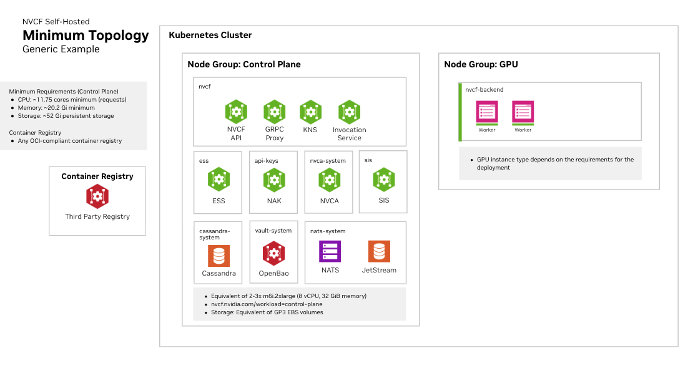

# Installation Overview

The self-managed control plane is the first NVCF stack you install. After it
is healthy you register one or more GPU clusters with it, then deploy
functions. The end-to-end sequence, from planning through operations, is in
the [Installation Guide](/nvcf/overview/installation-guide). This page helps
you choose how to install the control plane.

## Choose an installation path

| Path | Use when | Starting point |
| --- | --- | --- |
| One-click CLI (local) | You want to evaluate NVCF on a single local k3d cluster. `nvcf-cli self-hosted up` installs the control plane, registers the local cluster, installs NVCA, and runs health checks. Not for remote clusters. | [Quickstart](/nvcf/overview/quickstart) |
| Helmfile | You are installing on a real Kubernetes cluster and need explicit release control, partial recovery, upgrades, or direct access to Helmfile values. This is the production path. | [Helmfile Installation](./helmfile-installation.md) |
| CSP end-to-end example | You want a worked Amazon EKS walkthrough of the Helmfile path, single-cluster and multi-cluster, with the provider-specific values filled in. | [CSP End-to-End Example](./csp-end-to-end-example-installation.md) |

The control plane and the GPU cluster can be the same Kubernetes cluster or
separate clusters. The quickstart supports only a single local k3d cluster;
the Helmfile and CSP paths support both topologies.

## Before you start

- Size the clusters and storage. See [Infrastructure Sizing](/nvcf/overview/infrastructure-sizing).
- Make the stack artifacts reachable from your clusters, either directly from
  NGC or from a registry you mirror to. See [Manifest](/nvcf/overview/manifest)
  and [Image Mirroring](/nvcf/overview/image-mirroring).
- Prepare Gateway API ingress on the control-plane cluster. See
  [Gateway Routing](./gateway-routing.md#gateway-quickstart).

## Kubernetes cluster requirements

- Supported versions are the latest Kubernetes minor release and the two prior
  minor releases (N-2). See the Kubernetes
  [version skew policy](https://kubernetes.io/releases/version-skew-policy/#supported-versions).
- A StorageClass with dynamic persistent volume provisioning. Common options
  are `gp3` on Amazon EKS and `local-path` for local development. Some
  providers enforce a minimum PVC size; AWS EBS gp3 volumes have a 1Gi minimum.
- Kubernetes Network Policy support if you require network isolation.

GPU cluster requirements (the NVIDIA GPU Operator, the SMB CSI driver, and the
optional fake GPU operator for test environments) are listed in
[Register a GPU Cluster](/nvcf/compute-plane/register-gpu-cluster).

## After the control plane is installed

1. [Register a GPU Cluster](/nvcf/compute-plane/register-gpu-cluster) and install the NVCA operator on it.
2. Enable optional features as needed: [LLS Installation](./lls-installation.md), [Gateway Routing](./gateway-routing.md), [NVCF UI](./nvcf-ui.md), and the compute-plane [caches](/nvcf/compute-plane/simulation-caches).
3. Deploy and invoke a function. See [Function Creation](/nvcf/overview/function-creation).
