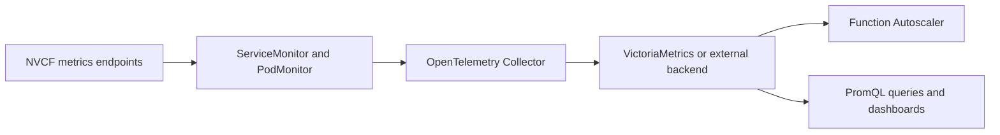

# Observability Configuration

The self-managed stack can collect NVCF metrics and write them to a bundled or
customer-managed backend. Logs and traces use separate configuration.

## Observability profiles

Set one profile in the Helmfile environment:

```yaml
observability:
  profile: control
```

The control-plane and compute-plane stacks use the same profile names for
different parts of observability. A split deployment normally uses `control`
on the control-plane cluster and `compute` on each compute cluster.

| Profile | Shared stack monitor defaults | Function Autoscaler in control plane | NVCA observability defaults in compute plane |
| --- | --- | --- | --- |
| `disabled` | None | Not installed | Disabled |
| `control` | Control-plane services | Installed | Disabled |
| `compute` | NVCA, DCGM, and worker pods | Not installed | Enabled |
| `all` | Control-plane and compute-plane targets | Installed | Enabled |

The `all` profile is intended for a cluster that contains both control-plane
and compute-plane targets.

The self-managed control-plane stack defaults to `control` and delegates an
enabled profile to the shared observability stack. The compute-plane stack
defaults to `compute`. It enables the NVCA OpenTelemetry Collector sidecar and
the `BYOObservability` feature gate, but does not install the shared
observability stack or VictoriaMetrics.

When the shared observability stack runs, an enabled profile installs these
components by default:

- Prometheus Operator custom resource definitions for `ServiceMonitor` and
  `PodMonitor`.
- OpenTelemetry Operator.
- OpenTelemetry Collector with Target Allocator and discovery role-based access
  control (RBAC).
- VictoriaMetrics.
- Default NVCF monitor resources.

The self-managed control-plane stack installs State Metrics when
`stateMetrics.enabled` is `true`. For `control` and `all`, it also installs the
Function Autoscaler and requires State Metrics.

`global.observability.metrics.enabled` is not the profile selector. Some
service charts still use it to enable their own metric exports or PodMonitors.
Set it separately when those service metrics are needed.

## Shared metrics flow



The Target Allocator discovers monitors labeled
`nvcf.nvidia.com/observability-target: "true"`. The collector scrapes the
selected endpoints and sends samples through Prometheus remote write.

Within the shared stack, the default control-plane monitors select State
Metrics, Invocation Service, gRPC Proxy, and LLM API Gateway. The default
compute-plane monitors select NVCA, DCGM, and NVCA-managed worker pods.

## Bundled VictoriaMetrics

The default backend is a single VictoriaMetrics instance in the `monitoring`
namespace. The stack derives these endpoints:

```text
remote write: http://vmsingle.monitoring.svc.cluster.local:8428/api/v1/write
PromQL:       http://vmsingle.monitoring.svc.cluster.local:8428
```

The default storage settings are:

```yaml
victoriaMetrics:
  server:
    retentionPeriod: "1"
    persistentVolume:
      enabled: true
      size: 16Gi
      storageClass: ""
```

Set `storageClass` for the target cluster. If you change
`observability.namespace` or `victoriaMetrics.namespace`, the stack derives the
service addresses from that namespace.

The bundled VictoriaMetrics service has a cluster-local endpoint and uses no
application-level authentication. Keep it cluster-local unless you add network
and access controls.

## Existing metrics backend

Use `metricsBackend.mode: existing` when the stack should write to and query a
customer-managed backend:

```yaml
observability:
  profile: control

metricsBackend:
  mode: existing
  type: external
  remoteWriteEndpoint: https://metrics.example.com/write
  promqlEndpoint: https://metrics.example.com
  authentication:
    mode: none
```

`remoteWriteEndpoint` is required for an existing backend. `promqlEndpoint` is
also required for `control` and `all` because the Function Autoscaler queries
it.

For the Function Autoscaler's PromQL client, authentication modes are `none`,
`token`, and `mtls`. Token authentication requires `authnEndpoint`. mTLS
requires `clientCertificatePath` and `clientPrivateKeyPath`.

These settings apply only to the Function Autoscaler's PromQL client. They do
not configure collector remote-write authentication or mount credentials and
certificates. Configure remote-write authentication separately under
`collector.config.exporters.prometheusremotewrite`.

## Component ownership

Profiles set defaults. Override a component only when another deployment owns
it:

| Mode | Meaning |
| --- | --- |
| `install` | The NVCF observability stack installs the component. |
| `existing` | The component is managed outside this stack. |
| `disabled` | The component is not used. |

For example, keep customer-managed Prometheus Operator CRDs, OpenTelemetry
Operator, and metrics backend:

```yaml
observability:
  profile: control
  components:
    prometheusOperatorCrds:
      mode: existing
    otelOperator:
      mode: existing

metricsBackend:
  mode: existing
  type: external
  remoteWriteEndpoint: https://metrics.example.com/write
  promqlEndpoint: https://metrics.example.com
```

The configurable components are:

- `observability.components.prometheusOperatorCrds`
- `observability.components.otelOperator`
- `observability.components.collector`
- `observability.components.targetAllocator`
- `observability.components.discoveryRbac`
- `metricsBackend`

Helmfile rejects combinations that leave an installed component without a
required dependency.

## Monitor overrides

Profiles select monitor groups, but each group and target can be overridden:

```yaml
observability:
  profile: control

defaultMonitors:
  controlPlane:
    enabled: true
  computePlane:
    enabled: false
    worker:
      enabled: false
```

The shared collector discovers targets only in its Kubernetes cluster. The
compute-plane stack does not install this shared collector. For a split
deployment, configure compute-plane collection separately and make any worker
metrics used for autoscaling available to the control-plane backend. See
[Cluster Monitoring](./cluster-management/monitoring.md).

## Dashboards

The shared stack does not install a dashboard UI. Query the bundled or external
backend with a PromQL-compatible tool. The
[Example Dashboards](./example-dashboards.md) guide deploys a separate
development reference stack with its own metrics components. Review component
ownership before using both stacks in one cluster.

## Logs

NVCF services write logs to standard output and standard error. The metrics
profile does not install a log backend. Use a Kubernetes log collector such as
Fluent Bit, Fluentd, Promtail, or an OpenTelemetry Collector configured for
logs.

## Tracing configuration

Control-plane services can export traces to an OpenTelemetry Protocol (OTLP)
endpoint configured under `global.observability.tracing`:

```yaml
global:
  observability:
    tracing:
      enabled: true
      collectorEndpoint: otel-collector.monitoring.svc.cluster.local
      collectorPort: 4317
      collectorProtocol: http
```

`collectorProtocol` supplies the URI scheme used by the stack. It does not
select the OTLP transport.

## Verify

Check the shared components:

```bash
kubectl get pods,pvc -n monitoring
kubectl get opentelemetrycollector -A
kubectl get servicemonitor,podmonitor -A
```

Replace `monitoring` if the observability components use another namespace.

For `control` and `all`, also check:

```bash
kubectl get deployment -n nvcf \
  -l app.kubernetes.io/instance=state-metrics
kubectl get deployment -n nvcf \
  -l app.kubernetes.io/instance=function-autoscaler
```

See [Function Autoscaler Operations](./autoscaling/operations.md) for backend
and health checks.

## Troubleshooting

| Symptom | Check |
| --- | --- |
| No observability releases | Confirm that `observability.profile` is not `disabled`. |
| VictoriaMetrics pod is pending | Check the persistent volume claim and configured storage class. |
| Metrics backend has no samples | Check the monitor labels, Target Allocator, collector logs, and remote-write endpoint. |
| Worker metrics are missing in a split deployment | Check compute-plane collection and connectivity to the backend queried by the autoscaler. |
| Function Autoscaler is not installed | Use the `control` or `all` profile and keep State Metrics enabled. |
| Function Autoscaler is not ready | Check Cassandra and the PromQL endpoint with the autoscaler health endpoint. |
| External backend authentication fails | Check the selected authentication mode and its required endpoints or certificate paths. |

## Related documentation

- [Metrics Overview](./metrics/metrics-index.md)
- [Function Autoscaling](./autoscaling/index.md)
- [Function Autoscaler Observability](./autoscaling/observability.md)
- [Cluster Monitoring](./cluster-management/monitoring.md)
- [Example Dashboards](./example-dashboards.md)
- [Control Plane Operations](./control-plane-operations.md)
