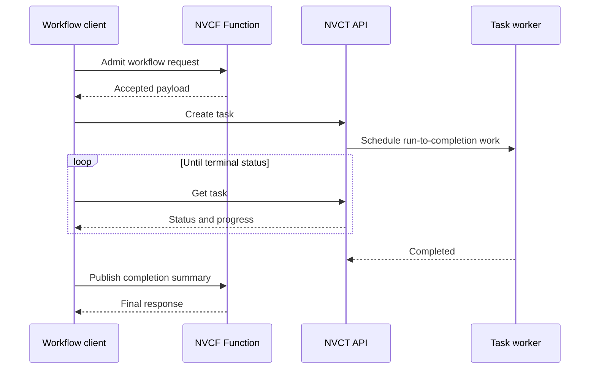

# Function and Task Pipeline

This reference architecture combines a long-running NVCF Function with a
run-to-completion NVIDIA Cloud Task (NVCT). A client-side coordinator owns the
workflow state:

1. Invoke the function for the interactive admission stage.
2. Submit a task for the batch stage.
3. Poll the task until it reaches a terminal state.
4. Invoke the function with the completion summary.

The sample reuses the existing FastAPI echo function and simple task containers.
It adds no service dependencies.



## Why use this pattern

Functions and Tasks have different lifecycles:

- The function remains deployed and handles low-latency requests.
- The task receives dedicated scheduling and runs once to completion.
- The client keeps the task ID and controls retry, timeout, and cleanup policy.

This pattern keeps task credentials in the client. The function does not need
permission to create or inspect tasks.

## Prerequisites

- A self-hosted NVCF stack with function and task routes.
- `nvcf-cli` configured for the stack. The config must include
  `base_nvct_url` and `nvct_host`.
- An admin token and both API keys in the CLI state:

  ```bash
  nvcf-cli --config <config-path> init
  nvcf-cli --config <config-path> api-key generate
  ```

- `jq`.
- A registry that the compute plane can pull from.

## Build and publish the sample images

From the repository root, build the function image:

```bash
docker buildx build \
  --platform linux/amd64 \
  --tag <registry>/<namespace>/fastapi-echo-sample:<tag> \
  --push \
  examples/function-samples/fastapi-echo-sample
```

Build the task image:

```bash
docker buildx build \
  --platform linux/amd64 \
  --tag <registry>/<namespace>/task-simple-sample:<tag> \
  --push \
  examples/task-samples/task-simple-sample
```

Register pull credentials if the registry is private. See
[`examples/README.md`](../../README.md#publishing-container-images).

## Run the workflow

Set the required inputs:

```bash
export NVCF_CLI_CONFIG=<config-path>
export FUNCTION_IMAGE=<registry>/<namespace>/fastapi-echo-sample:<tag>
export TASK_IMAGE=<registry>/<namespace>/task-simple-sample:<tag>
```

Run the coordinator:

```bash
./run.sh
```

The script prints one JSON summary after both stages complete. It removes the
task, function deployment, and function definition on exit.

Set `KEEP_RESOURCES=true` to inspect the resources after the run:

```bash
KEEP_RESOURCES=true ./run.sh
```

## Configuration

| Variable | Default | Purpose |
| --- | --- | --- |
| `NVCF_CLI_CONFIG` | Required | Path to the self-hosted CLI config. |
| `FUNCTION_IMAGE` | Required | Published FastAPI echo image. |
| `TASK_IMAGE` | Required | Published simple task image. |
| `NVCF_CLI_BIN` | `nvcf-cli` | CLI binary or absolute path. |
| `WORKFLOW_ID` | UTC timestamp | Suffix for function and task names. |
| `WORKFLOW_MESSAGE` | `function-task-pipeline` | Payload sent to the admission function. |
| `GPU` | `H100` | GPU name for both workloads. |
| `INSTANCE_TYPE` | `NCP.GPU.H100_8x` | Instance type for both workloads. |
| `BACKEND` | `ncp-local` | Compute backend name. |
| `REGIONS` | `us-west-1` | Function deployment regions. |
| `FUNCTION_DEPLOY_TIMEOUT_SECONDS` | `900` | Maximum function deployment wait time. |
| `POLL_INTERVAL_SECONDS` | `10` | Delay between task status requests. |
| `TASK_TIMEOUT_SECONDS` | `900` | Maximum task wait time. |
| `KEEP_RESOURCES` | `false` | Preserve resources when set to `true`. |

## Failure behavior

- A task terminal status other than `COMPLETED` fails the workflow.
- A task timeout fails the workflow and attempts task cancellation.
- Cleanup is best effort and does not replace the original exit status.
- `KEEP_RESOURCES=true` disables automatic cleanup for debugging.

The shell process is the coordinator, so it is not durable across client
failure. A production workflow should store the task ID in durable state, use
an idempotency key for submission, and resume polling after a restart.

## Validate without a cluster

The test replaces `nvcf-cli` with a deterministic fake. It checks command
ordering, terminal-state handling, JSON output, and cleanup:

```bash
./test_run.sh
```
