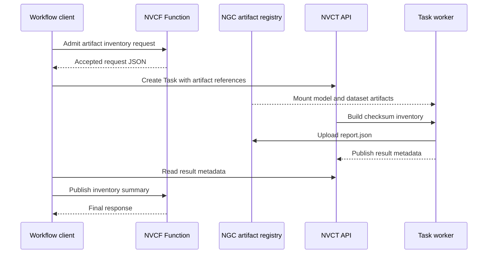

# Model Artifact Inventory Pipeline

This reference architecture combines a long-running NVCF Function with a
run-to-completion NVIDIA Cloud Task (NVCT). It implements a model artifact
inventory flow:

1. The client sends a model and dataset request to the Function.
2. The Function admits the request and returns the accepted payload.
3. The client mounts the accepted model and dataset artifacts into a Task.
4. The Task hashes the admitted model and dataset directories and uploads an
   inventory report. NVCT exposes both artifact kinds through one shared volume,
   so the coordinator selects their distinct name-based subdirectories.
5. The client reads the Task result metadata and sends it to the Function.

The Function uses the existing FastAPI echo sample, so this example treats its
echoed response as the accepted request. Replace that endpoint with application
policy for a production admission stage. The Task image in this directory
computes a deterministic checksum inventory with the Python standard library.
It adds no service or package dependencies.



## Why use this pattern

Functions and Tasks have different lifecycles:

- The Function remains deployed for low-latency admission and completion calls.
- The Task receives dedicated scheduling for bounded batch processing.
- NGC artifact references carry large model and dataset inputs.
- The Task result carries the configured NGC destination, relative report path,
  and bounded metadata back to the client.
- The client keeps the Task ID and controls retry, timeout, and cleanup policy.

The Function does not need Task or NGC credentials. The coordinator owns those
credentials and transfers only the accepted request and inventory summary.

## Task output

The Task scans the mounted model and dataset directories without following
symlinks or non-regular files. It excludes the worker-init
`.nvcf_manifest.json` control file at each mount root and writes
`artifact-inventory/report.json` locally with:

- the admitted workflow request;
- relative path, size, and SHA-256 for every model file;
- relative path, size, and SHA-256 for every dataset file;
- file counts and total bytes.

For `UPLOAD`, worker-task uploads the contents of that directory as an NGC model
version named `artifact-inventory_<uuid>`, so the uploaded object path is
`report.json`. The progress metadata contains the counts, total bytes, workflow
ID, configured NGC result destination, uploaded object path, and report SHA-256.
The coordinator checks the suffixed result name and that metadata before it
advances to the Function completion call.

This example inventories the transferred artifact bytes. It does not compare
them with an expected digest or signature. Replace the inventory worker with
training, evaluation, reinforcement learning, or policy verification code while
keeping the same admission, artifact, result, and completion boundaries.

## Prerequisites

- A self-hosted NVCF stack with Function and Task routes.
- `nvcf-cli` configured for the stack. The config must include
  `base_nvct_url` and `nvct_host`. Use a dedicated config filename with a
  unique basename because CLI commands update the current Function and Task
  context associated with that filename.
- An admin token and both API keys in the CLI state:

  ```bash
  nvcf-cli --config <config-path> init
  nvcf-cli --config <config-path> api-key generate
  ```

- `jq`.
- A registry that the compute plane can pull container images from.
- One NGC model artifact and one NGC resource artifact for the dataset.
- An NGC API key with write permission for the result location.

## Build and publish the images

From the repository root, build the Function image:

```bash
docker buildx build \
  --platform linux/amd64 \
  --tag <registry>/<namespace>/fastapi-echo-sample:<tag> \
  --push \
  examples/function-samples/fastapi-echo-sample
```

Build the inventory Task image:

```bash
docker buildx build \
  --platform linux/amd64 \
  --tag <registry>/<namespace>/model-artifact-inventory:<tag> \
  --push \
  examples/reference-architectures/function-task-pipeline/task
```

Register pull credentials if the container registry is private. See
[`examples/README.md`](../../README.md#publishing-container-images).

## Run the workflow

Artifact inputs use the `name:version:uri` form accepted by `nvcf-cli`.

```bash
export NVCF_CLI_CONFIG=<config-path>
export FUNCTION_IMAGE=<registry>/<namespace>/fastapi-echo-sample:<tag>
export TASK_IMAGE=<registry>/<namespace>/model-artifact-inventory:<tag>
export MODEL_ARTIFACT=<name>:<version>:<ngc-model-uri>
export DATASET_ARTIFACT=<name>:<version>:<ngc-resource-uri>
export RESULTS_LOCATION=<org>/[<team>/]<model>
export NGC_API_KEY=<ngc-api-key>
```

Run the coordinator from the repository root:

```bash
examples/reference-architectures/function-task-pipeline/run.sh
```

The script prints one JSON summary after both stages complete. It removes the
Task, Function deployment, and Function definition on exit. The uploaded NGC
result remains at `RESULTS_LOCATION`. The NGC key is written to a mode-600
temporary Task input file and removed immediately after Task submission. It is
not forwarded through child-process arguments or environments.

Set `KEEP_RESOURCES=true` to keep the NVCF resources for inspection:

```bash
KEEP_RESOURCES=true \
  examples/reference-architectures/function-task-pipeline/run.sh
```

## Configuration

| Variable | Default | Purpose |
| --- | --- | --- |
| `NVCF_CLI_CONFIG` | Required | Path to the self-hosted CLI config. |
| `FUNCTION_IMAGE` | Required | Published FastAPI echo image. |
| `TASK_IMAGE` | Required | Published inventory Task image. |
| `MODEL_ARTIFACT` | Required | Model artifact in `name:version:uri` form. |
| `DATASET_ARTIFACT` | Required | Dataset resource in `name:version:uri` form. |
| `RESULTS_LOCATION` | Required | NGC model location for uploaded reports. |
| `NGC_API_KEY` | Required | NGC key with write permission for results. |
| `NVCF_CLI_BIN` | `nvcf-cli` | CLI binary or absolute path. |
| `WORKFLOW_ID` | UTC timestamp | Suffix for Function and Task names. |
| `GPU` | `H100` | GPU name for both workloads. |
| `INSTANCE_TYPE` | `NCP.GPU.H100_8x` | Instance type for both workloads. |
| `BACKEND` | `ncp-local` | Compute backend name. |
| `REGIONS` | `us-west-1` | Function deployment regions. |
| `FUNCTION_DEPLOY_TIMEOUT_SECONDS` | `900` | Function deployment deadline. |
| `POLL_INTERVAL_SECONDS` | `10` | Delay between status and result requests. |
| `TASK_TIMEOUT_SECONDS` | `900` | Task execution deadline. |
| `TASK_STATUS_READ_ATTEMPTS` | `3` | Consecutive status read attempts before failure. |
| `TASK_EVENTS_TIMEOUT_SECONDS` | `30` | Best-effort Task events request deadline. |
| `RESULTS_TIMEOUT_SECONDS` | `120` | Task result availability deadline. |
| `CLEANUP_DELETE_ATTEMPTS` | `6` | Attempts for each cleanup deletion. |
| `CLEANUP_RETRY_INTERVAL_SECONDS` | `5` | Delay between cleanup attempts. |
| `KEEP_RESOURCES` | `false` | Preserve NVCF resources when `true`. |

## Failure behavior

- Missing model or dataset files fail the Task.
- A Task terminal status other than `COMPLETED` fails the workflow.
- A Task timeout caps each status request to the remaining workflow time,
  fails the workflow, and attempts Task cancellation.
- The result deadline caps each result request to its remaining time.
- Missing or invalid result metadata fails the workflow before the completion
  call.
- Cleanup failures preserve an existing failure status. If the workflow
  succeeded, incomplete cleanup changes the exit status to nonzero and prints
  the resource IDs that require inspection.
- `KEEP_RESOURCES=true` disables automatic NVCF cleanup.

The shell process is the coordinator, so it is not durable across client
failure. A production coordinator should persist the workflow ID, Task ID, and
result location immediately after submission. On restart, it should resume an
existing Task instead of submitting a duplicate.

## Validate without a cluster

Run the Task unit tests and the coordinator test:

```bash
python3 -m unittest discover \
  -s examples/reference-architectures/function-task-pipeline/task \
  -p 'test_*.py'
examples/reference-architectures/function-task-pipeline/test_run.sh
```

The coordinator test replaces `nvcf-cli` with a deterministic fake. It checks
accepted-artifact handoff, secret handling, result selection and polling,
command order, terminal states, JSON output, and cleanup.
