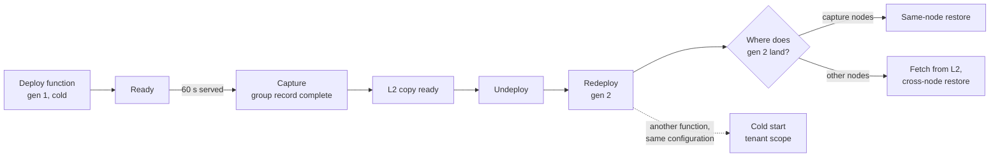

<!--
SPDX-FileCopyrightText: Copyright (c) 2026 NVIDIA CORPORATION & AFFILIATES. All rights reserved.
SPDX-License-Identifier: Apache-2.0
-->

# CRIU test matrix

Goal: every workload shape nvsnap claims to capture and restore with CRIU is
deployed as an NVCF function, captured, and restored, on the capture node and
on another node, and every shape it refuses is shown to start cold.



## How to run a case

Each case is a values file for one chart, `tests/criu-matrix/chart`, deployable
as an NVCF Helm function.

```sh
cd tests/criu-matrix
helm package chart
helm push nvsnap-criu-matrix-0.1.0.tgz oci://<registry>/<namespace>
# Create a Helm function from the chart with cases/<case>.yaml as its values
# override, deploy it on a CRIU cluster (agent.captureMethod=criu), wait for
# Ready, wait for the capture, undeploy, deploy again.
```

A multi-pod case is captured only on request: its pods carry
`nvsnap.io/criu-capture: "true"` (`criuCapture: true`), or the cluster's chart
values list the function under `agent.criuCaptureOptIn`.

What to read, in the agent logs on the instance's nodes:

| Step | Agent log line | Object |
| --- | --- | --- |
| Capture | `CRIU group capture: recorded` | ConfigMap `nvsnap-system/nvsnap-criu-group-<key>`, `state: complete` |
| L2 | `L2 promote complete` | claim `rox-<hash>` Bound in the function's namespace |
| Admission | `CRIU group restore: pod admitted as its rank's restore placeholder` | pod annotation `nvsnap.io/criu-restore` |
| Fetch (other node) | `EnsureLocal: fetched from the L2 volume`, `L2 fetch: copy complete` (with GB/s) | |
| Restore | `CRIU auto-restore: restored` or `CRIU group restore: restored` | pod annotation `nvsnap.io/criu-restored` |

Time each run from the namespace's creation to every pod Ready, and compare
with the cold deploy of the same case.

## Workload shapes

| Case | Controller | Pods | Engine start | Exercises | Expected | Status |
| --- | --- | --- | --- | --- | --- | --- |
| `sts-setsid` | StatefulSet | 1 | detached with `setsid` | the plain CRIU path (control) | restored | Verified |
| `sts-shell` | StatefulSet | 1 | child of the shell | engine below the container's pid 1 | restored | Verified |
| `deploy-pid1` | Deployment | 1 | `exec`, pid 1 | pid-namespace dump and nested restore, unix listeners, stdio | restored | Verified |
| `deploy-pid1-nonroot` | Deployment | 1 | `exec`, uid 1000 | chunk store and model reachable by a non-root engine | restored | New |
| `deploy-hfhome` | Deployment | 1 | `exec`, chart sets `HF_HOME` | model lands where the chart says | restored | New |
| `pod-bare` | Pod | 1 | `exec` | no controller, no instance | never captured | Verified |
| `sts-tp2` | StatefulSet | 2 | `exec`, TP=2 over the network | group capture, address remap of the ranks' connections | restored | Known broken: the test engine's rendezvous times out |
| `lws-tp2` | LeaderWorkerSet | 2 | `exec`, TP=2 | LWS grouping and rank | restored | New (needs the LWS CRD) |
| `deploy-sglang` | Deployment | 1 | SGLang, pid 1 | a second engine | restored | New (needs an image for the node architecture) |

Real models, deployed as their own functions:

| Workload | Shape | Exercises | Status |
| --- | --- | --- | --- |
| 2-pod TP=8 vLLM (about 1.2 TB GPU memory per pod), NVCF Helm StatefulSet | multi-node NVLink, gpushare fabric | group capture, cross-node restore from L2 | Verified: cold 14m33s, same node 3m24s, other nodes 6m26s |
| Dynamo, aggregated and disaggregated (`examples/function-samples/helmchart-samples/dynamo-operator-sample`) | frontend, workers, etcd, NATS | non-root engine, connections to etcd and NATS after restore, prefill/decode KV transfer | In progress |

## Restore paths

Run on any case that restores; the 1-pod Deployment cases are the cheapest.

| Path | How to get it | Expected |
| --- | --- | --- |
| Same node | Undeploy, deploy again; the placeholders prefer the capture nodes | no fetch; restore only |
| Other node, from L2 | Keep gen 1 running and deploy a second instance; its pods land elsewhere | `fetched from the L2 volume` |
| Other node, function namespace gone | Undeploy, then deploy where the capture nodes are full | the L2 claim is minted in the L2 namespace |
| Another function, same configuration | Deploy the same case as a second function | cold start, no placeholder (tenant scope) |
| Restore fails | Break the checkpoint (for example, remove its directory on the node) | checkpoints blocked, pods replaced, configuration captured again |
| Restored engine dies | Kill the engine in a restored pod | pod replaced within a minute, checkpoints blocked |
| Agent restarts mid-capture | Roll the agents during a capture | instance replaced, record failed, captured again later |

## Model sources

| Source | Case | Expected landing |
| --- | --- | --- |
| Hugging Face, fetched by the engine, no `HF_HOME` | every default case | `/opt/nvsnap/hf`, `HF_HOME` set to it |
| Hugging Face, chart sets `HF_HOME` | `deploy-hfhome` | the chart's path |
| NGC download in an init container | the 2-pod TP=8 model | the chart's volume |

## Not covered

- Ray-based multi-node engines (`ray start --address`): not recognized as
  multi-node, so a Ray worker pod could be captured alone.
- Grove instances (Dynamo operator): grouping is implemented and unit-tested,
  not yet run on a cluster.
- Pods with an IMEX channel restore only when the channel is the same on the
  new pods.
