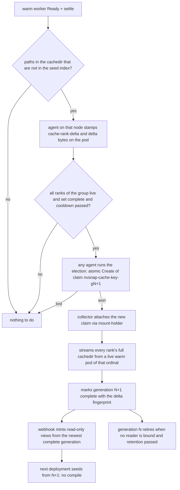

# Cache set refresh: sets that learn what warm starts compile

Goal: when a warm worker compiles something the shared cache set does not
have, the next deployment gets it from the set instead of compiling it
again. Today a set is collected once, from the cold run, and never
changes; everything a warm start JIT-compiles later lives in one pod's
emptyDir and dies with it.

Measured on GB300, 2026-10-01, Nemotron Omni with the vLLM startup plan:
every first start spent 24 s compiling one FlashInfer kernel the cold run
never produced. Restarted containers, which still had that kernel in
their emptyDir, started in 62 to 70 s against 93 to 100 s. That 30 s is
what this mechanism recovers, for this and every later case of the same
shape (new request shapes, new graph sizes, engine upgrades that JIT
lazily).

Extends `helm-shared-model-volume.md`, mechanism 5. Same identity, same
collector, same election. One new idea: a set has generations.

## Decisions

Generations, not in-place writes. A set is immutable once complete, like
the model volume. Writing into a live set would need a read-write attach
while readers hold shared read-only attaches, which NVMesh does not
promise, and would hand a changing tree to pods mid-seed. A refresh
writes a new volume and the identity `cache://<hash>` gains a generation
label. Readers of the old generation are unaffected; the reaper retires
it once nothing is bound to it and the retention has passed, the same
rule it applies today. Sets are small (8 GiB for eight ranks here), so a
full copy per refresh is cheap.

Warm pods are the source, not the old set. A warm pod's cachedir is the
seeded rank plus everything it compiled since, which is exactly the new
rank content. The collector streams each ordinal's full cachedir from a
live warm pod through the existing `GET /v1/cache-rank/{key}/{ordinal}`,
the same path the cold collection uses. No attach of the old generation,
no merge logic. If a rank has no live pod the round is skipped; the next
warm deployment tries again.

Delta detection by path against a seed index. The seed init already
copies the rank into the emptyDir (`cp -a`); it gains one line that
writes the list of seeded relative paths to `<cachedir>/.nvsnap-seeded`.
After Ready and the settle period the agent lists files under the
cachedir whose path is not in that index, ignoring lock files, logs and
`tmp` directories. Measured on GB300 (2026-10-01, six minutes of
traffic): a warm start rewrites 15 bookkeeping files (empty locks, the
autotune table re-saved, the JIT log) and writes nothing during serving,
so a path-based delta is empty on an ordinary warm start and non-empty
only when the engine produced something new. The count and bytes are
stamped on the pod as `nvsnap.io/cache-rank-delta` and
`cache-rank-delta-bytes`.

Bounded. A refresh needs: the set complete, at least one rank with a
delta, every rank of the group live, and no refresh of this set within
`agent.cacheVolume.refreshCooldown` (default 6 h). A loop guard
compares the delta fingerprint (sorted relative paths of the delta) with
the one recorded on the generation it came from; the same fingerprint
twice means the engine rewrites those files every start, the set is
marked `refresh-stable` and no further refresh runs until the salt or
the configuration changes.

## What changes

| Piece | Change |
|---|---|
| seed init (reader_steps.go) | writes the seeded path list to `<cachedir>/.nvsnap-seeded` after the copy |
| agent, after Ready + settle | path-set delta against the index, ignoring locks, logs and tmp; stamps delta annotations; calls the existing election with a generation suffix |
| modelvolume Lookup | today returns the first complete primary in list order (modelvolume.go, Lookup), which is arbitrary once there are two; it must sort by the generation label and return the newest; `Generation` on State |
| collector | unchanged streaming; marks the new primary with `generation`, `refreshed-from`, `delta-fingerprint` and the time |
| webhook complete branch | mints the read-only view from the generation Lookup returned (no change to the pod shape) |
| reaper | today keys "has a live reader" by identity (reaper.go, `live[identityKey(pv)]`), so a reader bound to generation 2 would keep generation 1 alive forever; liveness must be tracked per primary PV through its own read-only views, then superseded generations retire under the normal retention and never get a new view |
| values | `agent.cacheVolume.refreshCooldown: 6h`, `agent.cacheVolume.refresh: true` |

Nothing changes for the model volume, the cold capture, or a cluster
without warm deltas. A set that never gains files never refreshes.

## Verified against the code, and what is assumed

Verified: the rank endpoint `GET /v1/cache-rank/{key}/{ordinal}` and the
tar stream it serves; the atomic-Create election; the mount-holder
attach; `cp -a` in the seed step; the measured 25 to 28 s versus 3 s
capture and 62 to 70 s versus 93 to 100 s start times; the two places
named in the table that need a change for generations (Lookup picks the
first match today; the reaper keys liveness by identity today).

Assumed, to confirm during the build: that NVMesh refuses or mishandles a
read-write attach while shared read-only attaches are held. The
generation design does not depend on the answer, it only removes the
question. Known exposure, shared with the cold collection: a rank is
streamed while its engine serves traffic, so a file being written at
that instant can be captured partially; engines treat a bad cache entry
as a miss, and the next refresh replaces it.

## First run on GB300, 2026-10-01

Deployed warm against generation 1 with the refresh on: every rank
reported a delta within four minutes of Ready, one agent won the
election and collected generation 2 from the eight warm ranks in 59 s
(7.51 GB against 7.45 GB). Two findings changed the design slightly:

- The deltas were not one kernel. Under live traffic the engine kept
  compiling: Triton kernels for guided decoding and a batched outer
  product, torch.compile graphs for new input shapes, CUDA JIT cache
  entries, between 1 and 38 files per rank in the first minutes. A
  one-shot cold set can never carry those; the refresh is their only
  path into the set. A rank's delta also depends on which requests it
  served, so ranks differ.
- The Mamba kernel that started this was in generation 1 for some ranks
  after all, and FlashInfer rebuilt it anyway: the rank stream dropped
  modification times, every seeded file carried the collection time,
  and ninja treats that as stale. The stream now keeps mtimes to the
  nanosecond. The cold collection has the same path for remote ranks,
  so this also fixes the cold set.

A pod is stamped with the generation it was seeded from and only ranks
seeded from the serving generation take part in a refresh; otherwise the
first warm deployment keeps proposing after its own refresh.

Bounding the churn. Only files the engine wrote before it reported Ready
count as a delta: those are what the next start pays for. What serving
compiles for new request shapes differs on every rank with every
traffic mix and would otherwise refresh the set, 7.5 GB and a new
volume, at every cooldown for as long as traffic runs. The cooldown
default is 6 hours, and a superseded generation with no reader bound is
retired an hour after its last use rather than after the 7-day
retention. Expected steady state on this model: one refresh after the
startup path changes, then none.

## Failure behaviour

| Failure | Effect | Why it is bounded |
|---|---|---|
| collector dies mid-copy | generation N+1 never marked complete | existing abandoned-primary reaping; N stays the served generation |
| a rank's warm pod dies during streaming | round fails | claim times out and is cleaned as today; next deployment retries after cooldown |
| engine rewrites the same files every start | one refresh, then `refresh-stable` | loop guard on the delta fingerprint |
| two agents see the delta at once | one wins | atomic Create of the generation claim, same as the cold election |
| NVMesh attach slow | refresh takes longer | storage profile timeouts; readers never wait on a refresh |

## Verification

1. Unit: Lookup picks the newest complete generation; seed index
   written; delta scan reports only paths absent from the index and
   ignores locks, logs and tmp; cooldown and loop guard; reaper retires
   a superseded generation only when unbound.
2. GB300: deploy Omni warm against the current set, confirm the delta
   stamp names the Mamba kernel directory, confirm generation 2 is
   collected and complete. Deploy again: no compile, graph capture 3 s,
   first-start engine time near 65 s, admission to Ready near 160 s.
3. Deploy a third time: no delta stamped, no refresh, generation count
   unchanged. Confirm generation 1 retires after retention.
