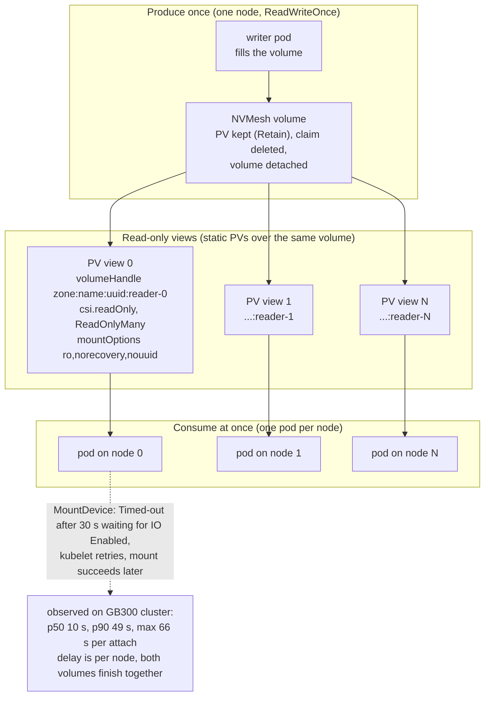

# Concurrent shared read-only attaches on NVMesh

A standalone reproduction of how nvsnap consumes volumes on block storage,
for storage validation. It needs a Kubernetes cluster with the NVMesh CSI
driver and a StorageClass; it does not need nvsnap.

## The workload shape

One volume is written once, then read by many pods at the same time. Each
worker pod of a model deployment attaches two such volumes: the model tree
and the compiled-kernel cache set. With eight workers that is sixteen
shared read-only attaches within a few seconds.



In production the writer is nvsnap's download or collection step and the
views are minted by nvsnap per consuming namespace; the objects are the
same as the ones this script creates.

## Run

```
export KUBECONFIG=...
READERS=8 SC=nvcf-sc NODE_SELECTOR=nvidia.com/gpu.present=true ./repro.sh run
./repro.sh cleanup
```

Parameters: `READERS` (pods and views, one per node), `SC` (StorageClass,
must be the NVMesh one), `NS` (namespace), `SIZE` (volume size), `FILL_MB`
(bytes written, so the read side is realistic), `NODE_SELECTOR`
(`key=value` to pin readers to a node pool), `IMAGE` (any image with sh
and dd).

## What it prints

Per reader pod: node, seconds from creation to scheduled, seconds from
creation to Running, and the number of `Timed-out after waiting 30.0
seconds for volume ... to have IO Enabled` events. Then min, median and
max time to Running across the pods. Pods that took over 30 s hit the
driver's IO-enable timeout at least once and were retried by kubelet.

Run it once with `READERS=1` for the single-client baseline (under a
second on the cluster measured) and once with `READERS=8` or more for the
concurrent case. Re-running `run` after `cleanup` produces a fresh volume.

## Related measurements

The report that motivated this (24 h of node-driver logs on an 18 node
GB300 cluster) is kept with the cluster's own data, outside this
repository. Its headline: 543 IO-enable timeouts in 24 h, all but 12 on
SHARED_READ_ONLY attaches, and each node's two attaches complete at the
same instant, so the wait is on the node's attach path rather than on a
volume.
